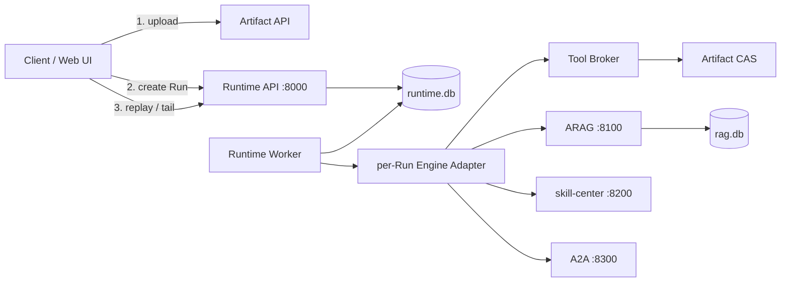

# sxw_agent-2_demo

一个面向个人学习、架构验证和面试讲解的 **单机持久化可靠 Agent Runtime 参考实现**。项目保留生产级 Agent 主链路的形状：durable Run、三代引擎、Tool effect、Artifact、HITL、混合召回 RAG、Skill/A2A、SSE 重放和结构化轨迹；它不承载真实线上流量，也不宣称分布式高可用。

逐步启动、配置和排障见 [RUNBOOK.md](RUNBOOK.md)，可靠性冻结规格见 [docs/reliability/README.md](docs/reliability/README.md)，黑盒行为评测见 [eval/README.md](eval/README.md)。

## 核心架构



对外是四个服务，实际至少五个进程：

| 服务 | 进程 | 端口 | 职责 |
|---|---|---:|---|
| Agent Runtime | Runtime API | 8000 | admission、状态、cancel/signal、Artifact、committed Event SSE；不加载 LLM 和远程工具目录 |
| Agent Runtime | Runtime Worker | 无监听端口 | 注册三个 engine release，加载 LLM/工具/Skill/A2A，领取 Activity 并执行 |
| ARAG | FastAPI + 进程内 index worker | 8100 | durable index job、版本化 Document、混合召回和 Evidence |
| skill-center | FastAPI | 8200 | Skill 目录/执行网关与 A2A 注册表 |
| A2A | FastAPI/ADK | 8300 | 远程 `math_expert` 子代理 |

API 返回 `202 Accepted` 只表示 Run 已提交到 `runtime.db`。HTTP 或 SSE 断开不会停止 Worker；取消必须显式调用 cancel API。

## 可靠性语义

- `Idempotency-Key` 在 `(principal_id, agent_id)` 范围内唯一；相同 key 与相同请求返回原 Run，不同请求返回 `409 IDEMPOTENCY_KEY_REUSE`。
- 同一 conversation 同时最多一个非终态 Run；真正的新 Run 冲突返回 `409 CONVERSATION_BUSY`。
- Worker 用 Activity lease、revision 和 fencing token 防止过期执行者迟到提交；进程丢失触发恢复，不直接把 Run 判为失败。
- Canonical Event 是 append-only；同 Run 的 `seq` 单调，只有 committed event 能被 SSE 读取。
- 最终 assistant message、citation 和成功 terminal 原子提交；部分 delta 即使可见，也不会自动进入后续 conversation history。
- Tool Broker 区分 `READ_ONLY / IDEMPOTENT_EFFECT / NON_IDEMPOTENT_EFFECT / UNKNOWN_EFFECT`。副作用 ACK 不明时保留 `UNKNOWN` 并 reconcile/manual，不能盲目重复。
- Artifact 以 SHA-256 内容寻址，写入采用临时文件、fsync、原子 rename；读取前校验 digest。非图片附件先给模型 8KiB preview，后续通过有界 `read_artifact` 读取；图片从已校验 CAS 物化为 attempt-local 多模态输入。rename 后 metadata 事务失败留下的 blob 会在超过 24 小时且仍无引用时由 Worker 清理。
- 首版 Delivery 只承诺 committed/AVAILABLE + 客户端 cursor；没有服务端投递确认，也不保存服务端观看位置。
- Trace 是诊断事实，关闭或丢失不影响恢复。

## 三代引擎：每个 Run 选择

CreateRun 的 `engine` 必填，可选：

| engine | 循环归属 | 特点 | 当前恢复边界 |
|---|---|---|---|
| `plan_execute` | decision plan + execution | 前置规划、过程可解释 | decision plan/整个 ADK attempt；不承诺模型调用中途确定性重放 |
| `agent_loop` | Google ADK `BaseLlmFlow` | ADK 驱动 Tool-Use Loop，插件与 LiteLlm 加固 | 整个 ADK invocation；不承诺模型调用中途确定性重放 |
| `native_loop` | 自研 `while` | 只读工具分批并发、流式工具执行、上下文压缩 | `native-kernel-v1` checkpoint：model request、完整 ToolCall batch、每个 ToolResult、next-turn/completed |

三者共享 RuntimeEnvelope、Canonical Event、Tool/Skill/RAG 下游与公开 SSE 契约。`SUB_AGENT_ENGINE` 取 `auto` 时跟随当前 Run 的 engine（`plan_execute` 映射到 ADK 子 Runner）；远端 A2A 使用自身 ADK，不受该设置影响。

`native_loop` 从最后 committed checkpoint 恢复；崩溃发生在半个 model stream 时会重放该 model slot，已提交的 ToolExecution 由稳定 slot 和 Tool Broker 复用。这不是 provider token 级或逐字节流重放承诺。`/reliability-demo` 在通用 kernel checkpoint 之上增加确定性的 WAITING_INPUT、signal 和独立幂等副作用纵切。

## 快速开始

要求 Python 3.12、Bash 3.2+ 和 `curl`。所有 Python 命令使用仓库 `.venv`，密钥只通过真实环境变量或被忽略的本地 `.env` 注入。

```bash
python3.12 -m venv .venv
.venv/bin/pip install -r requirements.txt
cp .env.example .env
# 编辑 .env，填写 DASHSCOPE_API_KEY
# 或不创建 .env，直接 export DASHSCOPE_API_KEY=真实值
bash scripts/run_all.sh
```

脚本按 A2A → skill-center → ARAG → Runtime Worker → Runtime API 启动。它先拒绝空/占位 Key，再等待本次 Worker 的新鲜 heartbeat、三个 release 与 active pointer 完全一致，随后提交样本索引任务并轮询到 `ACTIVATED`；任一进程早退、等待超时或 job 失败都会整体退出。真实环境变量优先于 `.env`，该规则也用于脚本绑定端口和定位 SQLite。打开 <http://127.0.0.1:8000/chat-ui/>；诊断轨迹控制台在 <http://127.0.0.1:8000/trace-ui/>（只读，回答下方的「查看轨迹」可直接跳转）。

开发可靠性测试额外安装：

```bash
.venv/bin/pip install -r requirements-dev.txt
bash scripts/check.sh
```

真实 LLM 启动、smoke 和行为评测仍需要有效 `DASHSCOPE_API_KEY`；可靠性 pytest 使用 fake/scripted 依赖，不需要真实模型。

## Run API 最小调用

### 1. 可选：上传图片/附件

```bash
curl -sS -X POST http://127.0.0.1:8000/api/v1/artifacts \
  -F 'file=@/absolute/path/to/image.png'
```

响应中的 `artifact_id` 是内容 SHA-256。公开上传默认最大 20MiB；单次 HTTP Range 最大 1MiB。非图片附件只把已校验的 8KiB preview 放入初始模型输入，模型可调用 `read_artifact(artifact_id, offset, max_bytes)` 继续读取（默认 32KiB、最大 64KiB）；图片从已校验 CAS 完整物化为本次 attempt 的多模态 Part。

### 2. 创建 Run

```bash
curl -i -X POST http://127.0.0.1:8000/api/v1/runs \
  -H 'Content-Type: application/json' \
  -H 'Idempotency-Key: demo-request-001' \
  -d '{
    "client_request_id":"11111111-1111-4111-8111-111111111111",
    "conversation_id":null,
    "principal_id":"demo-user",
    "agent_id":"demo-agent",
    "engine":"native_loop",
    "input":{
      "text":"什么是混合召回？",
      "attachment_refs":[]
    }
  }'
```

返回 `202`、`Location`、`run_id`、`conversation_id`、`status_url` 和 `events_url`。没有 active release 时返回 `503 NO_ACTIVE_RELEASE`。

### 3. 查询状态与订阅 committed events

```bash
RUN_ID=run_xxx
curl -sS "http://127.0.0.1:8000/api/v1/runs/$RUN_ID"
curl -N "http://127.0.0.1:8000/api/v1/runs/$RUN_ID/events?after_seq=0"
curl -N -H 'Last-Event-ID: 17' \
  "http://127.0.0.1:8000/api/v1/runs/$RUN_ID/events"
```

SSE 的 `id` 是 opaque、单调 cursor；visibility 过滤可能产生跳号。公开投影包括：

```text
text · tool_call · tool_result · plan_step · skill_event · citation
user_message · assistant_message · run_status · activity_status · terminal
```

Web UI 在同一页面断线时按 `last_seq` 续订；页面刷新后由于 DOM 不是持久化投影，会从 `after_seq=0` 重放 committed events 重建正文与过程，再继续 tail。停止观看仍不会取消 Run。

每 15 秒可能出现无 seq 的 heartbeat comment。读到 committed `terminal` 后连接关闭。

### 4. 显式取消

```bash
curl -X POST "http://127.0.0.1:8000/api/v1/runs/$RUN_ID/cancel" \
  -H 'Content-Type: application/json' \
  -d '{"command_id":"cancel-001","reason":"user requested"}'
```

### 5. HITL signal

当 GET Run 返回 `WAITING_INPUT`，使用其中的 `current_activity_id`：

```bash
curl -X POST "http://127.0.0.1:8000/api/v1/runs/$RUN_ID/signals" \
  -H 'Content-Type: application/json' \
  -d '{
    "signal_id":"approval-001",
    "wait_activity_id":"act_xxx",
    "type":"APPROVAL",
    "payload":{"approved":true}
  }'
```

若 `pending_input.type=TOOL_RECONCILIATION_REQUIRED`，只能提交受审计的 reserved signal；`tool_execution_id` 必须来自该 pending input，不能用普通 approval 直接唤醒：

```bash
curl -X POST "http://127.0.0.1:8000/api/v1/runs/$RUN_ID/signals" \
  -H 'Content-Type: application/json' \
  -d '{
    "signal_id":"reconcile-001",
    "wait_activity_id":"act_xxx",
    "type":"tool_reconciliation",
    "payload":{
      "tool_execution_id":"tool_xxx",
      "action":"mark_committed",
      "evidence":{"source":"provider-ledger","ticket":"INC-42"},
      "result":{"status":"SUCCESS","preview":{"confirmed":true}},
      "external_object_id":"external-task-42"
    }
  }'
```

`mark_failed` 必须给 `FAILURE + error_code/error_message`，结论为 sticky、不会透明重发；`reconcile` 不接受 result/ref，且仅在该 ToolExecution 已持久化 reconcile 能力时触发 query-only Worker 路径，原 Tool executor 与 EngineAdapter 均不会被调用。inline evidence/result 分别限 4KiB/8KiB，更大内容先上传 Artifact 并使用 `result_ref`。

同一 Run 有多个 unresolved effect 时一次 signal 只解决一个，最后一个才恢复普通执行。cancel 已先提交时仍可发送相同的严格处置信号：Run 始终保持 `CANCEL_REQUESTED`，最后一个 effect 确定后才 `CANCELLED`；hook 中断/无结论会回到人工边界，绝不会借恢复重发原副作用。具体操作与排障见 [RUNBOOK](RUNBOOK.md)。

通用 `native_loop` 会在 model request、完整 ToolCall batch、每个 ToolResult、next-turn/completed 边界写 kernel checkpoint；大 `read_artifact` 切片不复制进 checkpoint，而是依靠 Artifact 与已提交 ToolExecution 在恢复时重新物化。确定性长任务演示以 `/reliability-demo` 开头：前两次只读 lookup 失败后恢复，checkpoint 进入 `WAITING_INPUT`，signal 后以稳定幂等 key 在独立 `effects.db` 创建 demo task，并把大结果保存为 Artifact。

## ARAG：durable index job

```bash
# 提交样本入库，返回 202 + job_ids
curl -sS -X POST http://127.0.0.1:8100/v1/index/sample

# 轮询单个 job
curl -sS http://127.0.0.1:8100/v1/index/jobs/job_xxx
```

状态为：

```text
PREPARED → BUILDING → VALIDATING → READY → ACTIVATED | FAILED
```

Document/version/chunk 的权威数据位于 `local_storage/arag/rag.db`，原文位于内容寻址存储。numpy vector 与 BM25 是从 active version 重建的进程内不可变投影；旧 version 可保留审计，但 active pointer 切换后不可检索。检索明确区分 `HIT / MISS / DEGRADED / DENIED / ERROR`，Evidence 携带 document version、chunk hash、index version、page/span、scope 和 query 身份。

ARAG 会周期校验 active chunk 的 embedding model、维度与 checksum。向量行缺失或损坏时先保留 BM25 并明确返回 `DEGRADED`，再在 SQLite 事务外重新 embedding；发布时用 active source digest 做短事务 CAS，拒绝旧版本迟到覆盖。修复失败按指数退避重试，不会形成 250ms 热循环。

## 本地事实源

| 路径 | 角色 |
|---|---|
| `local_storage/runtime/runtime.db` | Run、Activity、Event、Checkpoint、ToolExecution、Signal、Timer、Release 权威 |
| `local_storage/arag/rag.db` | Document/version/chunk/index-job 权威及可重算 embedding rows |
| `local_storage/arag/documents/sha256/` | 原始文档内容寻址字节 |
| `local_storage/artifacts/sha256/` | Runtime Artifact 完整字节 |
| `local_storage/demo_effects/effects.db` | 模拟外部副作用系统，故意不与 Runtime 做跨库原子事务 |
| `local_storage/traces/` | 诊断轨迹，不参与恢复 |

Runtime SQLite 每连接启用 WAL、`synchronous=FULL`、foreign keys 和 busy timeout；数据库只支持当前 schema，identity（版本/checksum）不符会 fail-fast 并提示显式删库重建。该方案只承诺本机正常进程崩溃恢复，不承诺磁盘损坏、主机丢失、多机 HA 或共享盘部署。

## RAG、Skill 与 A2A

- RAG：query rewrite → numpy 余弦 + BM25/jieba → RRF → 低价值过滤；一路失败、另一路可用时返回 `DEGRADED`。
- skill-center：MCP 风格目录/执行网关；NDJSON 必须以独立 EOF 帧收口，首个失败 sticky 保留。
- Claude SKILL：Agent-as-Tool，每次复制完整技能包到独立 LocalSandbox；`agentbay` 仍是不可运行的 provider 桩。
- A2A：通过 skill-center 注册表发现远端 agent-card，每次调用是无父历史的新远端会话，请求必须自包含。

LocalSandbox 不是生产级隔离。当前不支持 Claude SKILL Artifact 跨 Skill 传递、子 Runner HITL/暂停恢复或真实 AgentBay；Runtime 本身具备 Artifact/signal 不代表这些能力已经自动接通。

## 验证与评测

```bash
# 静态编译 + reliability pytest + schema/checksum + 过时协议扫描
bash scripts/check.sh

# 真实 LLM 黑盒行为评测；同一 Runtime API 按 Run 选择 engine
export DASHSCOPE_API_KEY=sk-***
bash eval/run_eval.sh
```

可靠性测试是阶段门禁；真实 LLM harness 记录路由、工具、RAG 和回答行为，不替代事务/故障恢复测试。现有历史报告必须按报告中实际 engine 解读，不能把某一引擎数字套到另一引擎。

## 目录

```text
agent/runtime/       domain · application · ports · sqlite/artifact/engine adapters · worker · API
agent/engine/        plan_execute · agent_loop · native_loop · shared loop tools
agent/claude_skill/  SKILL Agent-as-Tool 与沙箱
arag/persistence/    rag.db、Document Version、Index Job
arag/projection/     numpy/BM25 不可变可重建投影
skillcenter/         Skill 网关与 A2A 注册表
a2a_service/         远端 ADK agent
common/              日志、trace、共享协议
tests/reliability/   fake/scripted 可靠性门禁
eval/                真实 LLM 黑盒行为评测
web/                 无构建步骤的 Runtime Web Chat
docs/reliability/    R0 冻结规格、ADR、Failure Matrix、JSON Schema
```

## 明确不包含

- 旧接口/旧本地数据迁移或兼容层
- Semantic/Episodic/Procedural Memory 与完整 Context Compiler
- PostgreSQL/Temporal backend 或双写
- 分布式多 Worker、多机 HA、主机/磁盘容灾
- 服务端 Delivery ACK
- ADK 两代引擎的 mid-turn deterministic replay
- 真实 AgentBay、Claude SKILL 跨 Skill Artifact 和子 Runner HITL
