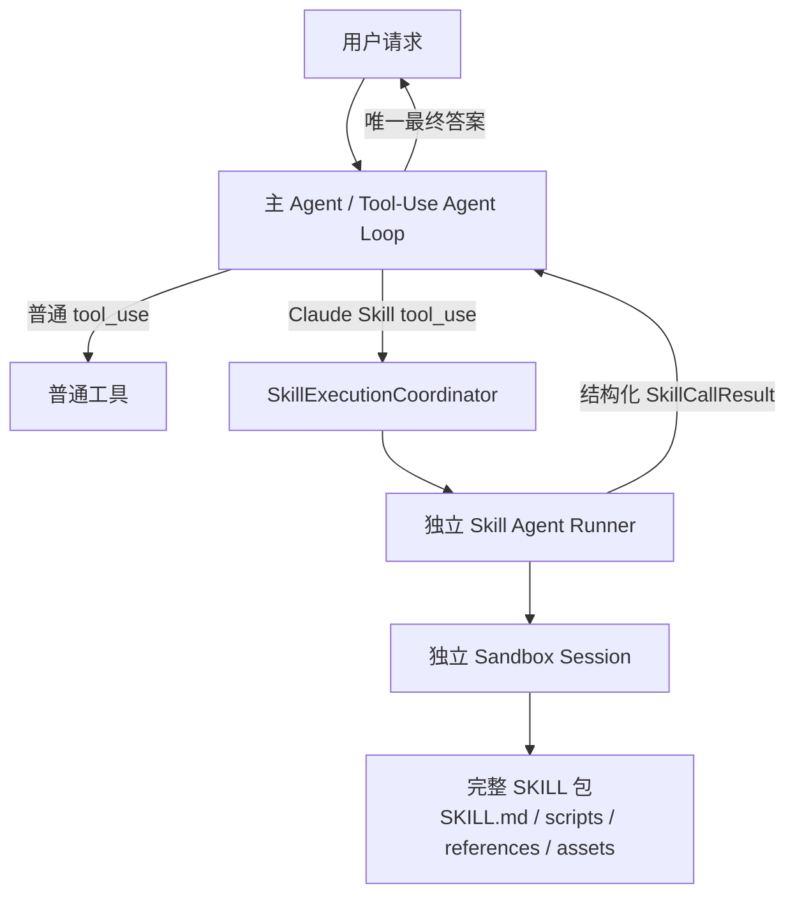

# 统一 Tool-Use Agent Loop + Agent-as-Tool 改造记录

- 生成时间：2026-08-05
- 目标项目：`sxw_agent-2_demo`
- 改造主题：统一 Tool-Use Agent Loop + Agent-as-Tool
- 参考实现：`albert-agent-2` 中的 SingleLoopFlow、Claude SKILL 与沙箱执行链路
- 验证范围：代码逻辑审查、工作区检查、指定虚拟环境下的 Python 语法编译

## 1. 改造背景

### 1.1 问题来源

本次改造是在分析参考项目以下三份报告后形成的：

- `SingleLoopFlow下SKILL技能调用与沙箱执行链路报告.md`
- `SingleLoopFlow多SKILL编排与独立SkillAgent问题分析.md`
- `SingleLoopFlow端到端调用链路报告.md`

原实现已经具备“一个 SKILL 包由一个独立 Skill Agent 在沙箱中执行”的基本形态，但多 Skill 场景下仍存在两套编排语义：

1. 主 Agent-Loop 负责普通工具调用与跨轮推理。
2. Skill Agent 侧又隐含一层较弱的技能编排与执行状态。

这会导致主 Agent 和 Skill Runtime 之间的职责边界不够稳定：主 Agent 不完全掌握依赖关系和失败反馈，Skill Runtime 又缺少完整的任务上下文，不适合继续演进成独立编排器。

### 1.2 改造前的核心问题

#### 1. 多 Skill 编排职责分散

- 串行依赖可能被固化在 Skill 侧，而不是由持有完整对话历史的主 Agent 决定。
- 同轮并行调用缺少“调用之间必须独立”的明确约束。
- 如果继续增加 MultiSkillOrchestrator、DAG 或独立 Skill 状态机，会形成第二套 Agent Loop，增加状态同步和异常恢复成本。

#### 2. 调用级身份不完整

- Skill 执行事件主要依赖技能名，无法稳定区分同名 Skill 的并行调用。
- 主 Agent 的 function call、子 Runner、沙箱 session、日志和 UI 事件缺少统一关联键。
- 非 ADK 直调缺少明确的身份降级策略。

#### 3. 父子 Agent 结果边界不清晰

- 子 Agent 的中间文本和终局文本可能混合聚合，容易把工具前说明或中间过程回灌父 Agent。
- Skill 结果没有统一、有界的结构化 envelope，多 Skill 结果容易撑大主上下文。
- 错误结果缺少稳定错误码和 `retryable` 语义，主 Agent 难以判断重试、换路或降级。

#### 4. SKILL 包运行不完整

- `SKILL.md` 正文在构建子 Agent 时直接注入 system instruction。
- Skill Agent 没有通过工具主动读取 `SKILL.md`，无法完整体现 Claude Code 风格的 SKILL 包运行方式。
- `scripts/`、`references/` 和二进制资源没有统一的整包 staging 契约。

#### 5. 生命周期治理不足

- 缺少调用总超时、子 Runner 模型调用上限和进程级并发上限。
- 同 invocation 串并行、跨请求独占资源没有统一治理点。
- SSE 客户端断开后，Runner pump、本地 shell/python 子进程和临时目录存在继续运行或延迟清理的风险。

#### 6. 主上下文和 UI 关联不足

- MessageBudget 只统计普通文本，没有完整计算 function call 参数和 function response JSON。
- 历史裁剪可能拆散工具调用与工具结果。
- Chat UI 没有按调用 ID 展示同名 Skill 的独立执行过程。

## 2. 核心设计共识

本次最终采用的架构共识是：

> 保留“一个 Skill Agent 执行一个 SKILL 包”，但把每次 Skill Agent 调用视为主 Agent 中的一次标准 `tool_use → tool_result`。

### 2.1 职责划分

#### 主 Agent-Loop 负责智能编排

- 根据完整对话历史决定调用哪个 Skill。
- 根据上游 `tool_result` 决定下一轮调用。
- 有数据依赖的 Skill 必须跨轮串行。
- 同轮多个 Skill 调用只允许用于彼此独立的任务。
- 根据结构化错误中的 `error.code` 和 `error.retryable` 决定重试、换路或降级。

#### Skill Runtime 只负责执行治理

- 一个调用只运行一个 SKILL 包。
- 管理调用身份、超时、模型调用次数、并发、独占资源、沙箱和取消清理。
- 将子 Agent 内部过程隔离在独立 Runner 中。
- 只向父 Agent 返回一个结构化、有界的终局结果。

#### ADK 继续负责工具协议

- function call/result 配对。
- 同一模型轮次中多个 function call 的 task 创建与并行执行。
- function response 回灌父模型。

`SkillExecutionCoordinator` 不参与任务拆解、依赖分析或顺序规划，因此它不是新的 MultiSkillOrchestrator。

### 2.2 架构关系



### 2.3 明确不引入的能力

本次不新增：

- MultiSkillOrchestrator、DAG 或独立 Skill 计划状态机。
- Artifact 跨 Skill 传递。
- HITL、暂停恢复和断点续跑。
- 真实 AgentBay SDK。
- Kinto、事务补偿和分布式恢复。
- 海量 Skill 的渐进式发现与披露。

## 3. 总体改造方案

### 3.1 建立调用级 Tool-Use 契约

每次技能调用从 ADK `ToolContext` 提取：

- `function_call_id` → `skillCallId`
- `invocation_id` → `parentInvocationId`

正常 ADK 调用直接复用框架 ID；直调或上下文缺失时生成 `call_<uuid>` / `invocation_<uuid>`，同时记录 WARNING 日志。

Claude SKILL 对父 Agent 统一返回：

```json
{
  "skillCallId": "adk-call-id",
  "skillId": "data_analysis",
  "status": "success",
  "summary": "面向主 Agent 的高信号终局结果",
  "isError": false,
  "error": null,
  "meta": {
    "attempts": 1,
    "truncated": false
  }
}
```

错误仍使用相同 envelope，稳定错误码为：

| 错误码 | 含义 | retryable |
|---|---|---|
| `SKILL_TIMEOUT` | 调用总超时 | `true` |
| `SKILL_SANDBOX_UNAVAILABLE` | 沙箱 provider 不可用 | `false` |
| `SKILL_PACKAGE_INVALID` | SKILL 包非法或无法安全装载 | `false` |
| `SKILL_INSTRUCTION_NOT_READ` | 两次子会话均未按契约先读 `SKILL.md` | `false` |
| `SKILL_EXECUTION_FAILED` | 子 Runner、模型调用上限或一般执行失败 | `true` |

`summary` 统一受 `SKILL_RESULT_MAX_CHARS` 限制，默认最多 8,000 字符，超出时截断并设置 `meta.truncated=true`。

### 3.2 增加 Skill Runtime 生命周期治理

新增进程级 `SkillExecutionCoordinator`，通过 `AgentContext` 依赖注入到全部 `ClaudeSkillTool`，不在 Tool 内维护隐式全局状态。

Coordinator 负责三层治理：

1. **invocation 读写门**
   - `parallel_safe=true` 且 `exclusive_resources=[]` 的调用作为 reader，可以相互并行。
   - 非并行安全或声明独占资源的调用作为 writer，对同一 invocation 的全部 Skill 调用排他。
   - writer 优先，避免持续的安全调用导致非安全调用饥饿。

2. **进程级全局 semaphore**
   - 所有 invocation 共享。
   - 默认最多同时执行 2 个 Claude SKILL 调用。

3. **命名独占资源锁**
   - `exclusive_resources` 按名称排序后获取。
   - 不同请求声明同名资源时也必须互斥。

### 3.3 升级为完整 SKILL 包运行

`ClaudeSkill` 不再保存提前解析出来的 instruction 正文，只保存发现和运行所需元数据：

- `skill_id`
- `name`
- `description`
- `root_dir`
- `parallel_safe`
- `exclusive_resources`

frontmatter 使用 `yaml.safe_load` 解析：

```yaml
---
name: 数据分析
description: 使用 Python 执行统计分析
parallel_safe: true
exclusive_resources: []
---
```

每次调用把完整技能目录复制到独立沙箱的 `skills/<skill_id>/`：

- 支持普通文本、脚本和二进制资源。
- 拒绝符号链接、特殊文件和路径逃逸。
- 忽略 `.git`、`__pycache__`、`.DS_Store` 等非运行资源。
- AgentBay 桩明确返回 unavailable，不伪装 staging 成功。

子 Agent 使用通用 system instruction，初始用户消息只传入任务、技能根目录和精确的 `SKILL.md` 路径，不再把 SKILL 正文直接注入 system instruction。

### 3.4 强制 instruction-first

子 Agent 必须先调用：

```text
read_file("skills/<skill_id>/SKILL.md")
```

实现中增加了两层保护：

1. 成功读取前，其他 file/shell/python 工具直接返回 `SKILL_INSTRUCTION_NOT_READ` guard 结果。
2. ADK 会并行执行同轮多个 function call，因此读取成功后通过 `call_soon` 延迟激活工具权限；同轮已经生成的 sibling tool call 仍会被拒绝并记录违规，只有下一模型轮次才允许继续执行。

如果第一次子会话没有合规读取 `SKILL.md`，在同一个调用总超时内创建全新的子 Runner/session 重试一次。第二次仍不合规则返回 `SKILL_INSTRUCTION_NOT_READ`。

如果未读指令时先触发 `SKILL_MAX_LLM_CALLS`，也会进入上述重试；如果已经合规读取后才触发上限，则返回一般执行失败。

### 3.5 收紧父子 Agent 输出边界

父 Agent 只接收子 Agent 最后一轮满足以下条件的文本：

- event author 是当前 Skill Agent。
- `partial=false`。
- content role 是 `model`。
- 无 function call。
- 无 function response。
- 排除 thought part。

子 Agent 的 partial 文本和中间说明不会进入父 tool result。UI 只展示调用状态、子工具调用和子工具结果；最终用户答案仍由主 Agent 唯一生成。

### 3.6 修正取消和本地进程清理

取消链路调整为：

```text
客户端断开
  → 关闭 SSE generator
  → cancel Runner pump
  → 等待 Runner 与在途 Tool 退出
  → Skill Runner 关闭
  → shell/python 进程组 TERM → 等待 → KILL
  → 删除临时沙箱目录
  → 重置 UI ContextVar
  → 重新抛出 CancelledError
```

关键约束：

- `CancelledError` 不得转换成 `SKILL_EXECUTION_FAILED`。
- 清理异常只记录日志，不能覆盖原始取消语义。
- shell/python 使用独立进程组，超时或取消时清理整个进程组。
- staging 和本地文件 I/O 使用线程执行；取消时等待不可中断的本地 I/O 收口。
- `read_file` 拒绝 FIFO、目录等非普通文件，避免阻塞线程和绕过总超时。
- 沙箱只在子 Runner 完全结束后关闭。

### 3.7 对齐主 Agent-Loop、上下文预算和 UI

主 Agent-Loop instruction 增加以下语义：

- Claude Skill 与普通工具一样通过 tool-use 调用。
- 依赖任务必须等待上游 tool result 后跨轮继续。
- 同轮 Skill 调用只适用于相互独立的任务。
- `update_task_plan` 是复杂任务的可选进度记录，不是调度器。
- 工具失败后根据结构化错误决定重试、换路或降级。

MessageBudget 调整为：

- 统计文本、function call 名称和参数 JSON。
- 统计 function response 名称和 response JSON。
- 按 call ID 把完整 function call/response 区间视为原子裁剪单元。
- 不主动制造孤立 function call 或孤立 function response。

SSE 与 UI 调整为：

- `tool_call` 和 `tool_result` 增加 ADK function call `id`。
- `skill_event` 统一携带 `parentInvocationId`、`skillCallId`、`skill`、`seq` 和 `subEvent`。
- Skill Center 展示帧继续保留原有 `requestId/seq`。
- Chat UI 在 tool call、tool result 和 skill event 标签中显示调用 ID，并保留完整 ID payload。

## 4. 具体代码改动点

### 4.1 调用契约与身份

| 文件 | 改动 |
|---|---|
| `agent/claude_skill/contracts.py` | 新增结构化结果、稳定错误码、运行配置和内部异常类型；成功与失败摘要统一截断。 |
| `agent/skills/call_identity.py` | 新增共享身份解析器；Claude SKILL 与 Skill Center 统一复用 ADK ID，缺失时 UUID 降级并告警。 |
| `agent/claude_skill/claude_skill_tool.py` | Claude Skill 改为标准 Agent-as-Tool；返回纯 JSON envelope，完成错误映射、总超时、Coordinator 租约和沙箱收口。 |

### 4.2 SKILL 目录与完整包运行

| 文件 | 改动 |
|---|---|
| `agent/claude_skill/catalog.py` | 使用 PyYAML 安全解析；严格校验 skill ID、工具名、重复名称、frontmatter 类型、根目录和根 `SKILL.md`。 |
| `agent/claude_skill/skill_runner.py` | 改为通用 system instruction；整包 staging；两次独立子会话；显式 `max_llm_calls`；只提取终局聚合文本。 |
| `agent/claude_skill/toolset.py` | 记录成功读取路径，增加 instruction-first guard、同轮激活屏障和违规状态。 |
| `agent/claude_skill/skills_data/data_analysis/SKILL.md` | 增加 `parallel_safe: true` 和 `exclusive_resources: []`。 |
| `requirements.txt` | 显式增加 `PyYAML>=6,<7`。 |

### 4.3 并发与生命周期

| 文件 | 改动 |
|---|---|
| `agent/claude_skill/execution_coordinator.py` | 新增 invocation 读写门、进程级 semaphore 和命名资源锁；取消时保证租约释放。 |
| `agent/context.py` | 在进程上下文中构造 Coordinator，通过依赖注入传给全部 ClaudeSkillTool。 |
| `agent/config.py` | 增加四项 Skill Runtime 配置，并校验为正数；限制 sandbox provider 为 `local/agentbay`。 |
| `.env.example` | 补充四项默认配置示例。 |

新增配置：

| 环境变量 | 默认值 | 作用 |
|---|---:|---|
| `SKILL_CALL_TIMEOUT_SECONDS` | `120` | 覆盖排队、装载、子 Runner 执行与结果整理。 |
| `SKILL_MAX_LLM_CALLS` | `16` | 单个子 Runner 最大模型调用次数。 |
| `SKILL_MAX_PARALLEL_CALLS` | `2` | 进程内 Claude SKILL 最大并发数。 |
| `SKILL_RESULT_MAX_CHARS` | `8000` | 回灌父 Agent 的 summary 最大字符数。 |

### 4.4 沙箱与取消

| 文件 | 改动 |
|---|---|
| `agent/claude_skill/sandbox/base.py` | Sandbox 抽象增加 `stage_directory`。 |
| `agent/claude_skill/sandbox/local_sandbox.py` | 实现安全整目录复制、文件类型检查、线程化文件 I/O、独立进程组以及 TERM/KILL 清理。 |
| `agent/claude_skill/sandbox/agentbay_sandbox.py` | staging 明确返回 unavailable，保持云沙箱桩的诚实边界。 |
| `agent/skills/stream_merge.py` | SSE 关闭时主动 cancel 并等待 Runner pump，之后关闭事件生成器并重置 ContextVar。 |

### 4.5 SSE、Skill Center、消息预算与 UI

| 文件 | 改动 |
|---|---|
| `agent/stream/event_converters.py` | `tool_call/tool_result` 透出 ADK function call/response ID。 |
| `agent/skills/result_parser.py` | Skill Center `skill_event` 增加调用身份和 `subEvent`，保留 `requestId/seq`。 |
| `agent/skills/selected_skill_tool.py` | 从 ToolContext 获取调用身份，日志和展示帧使用相同 ID。 |
| `agent/engine/agent_loop/message_budget.py` | 计入工具 JSON，并按完整调用—响应关联区间进行原子裁剪。 |
| `agent/engine/agent_loop/agent_loop_engine.py` | 更新 Tool-Use Agent Loop、依赖串行、独立并行、错误重试和可选计划语义。 |
| `web/app.js` | tool call、tool result 和 skill event 按调用 ID 展示，同名并行调用可区分。 |

### 4.6 文档同步

以下文档统一更新为“Tool-Use Agent Loop + Agent-as-Tool”架构描述：

- `README.md`
- `RUNBOOK.md`
- `AGENTS.md`
- `CLAUDE.md`

同步内容包括：

- 架构名称和主从职责。
- 新配置及默认值。
- SKILL frontmatter 契约。
- 完整包目录语义。
- invocation 内串并行与跨请求资源锁规则。
- Artifact、HITL 和真实 AgentBay 等未实现边界。

## 5. 改造后的端到端调用链

一次 Claude SKILL 调用的完整过程如下：

1. 主模型生成 Claude Skill function call。
2. ADK 为 function call 分配 ID，并创建 `ToolContext`。
3. `ClaudeSkillTool` 解析 `skillCallId/parentInvocationId`。
4. 调用进入 120 秒总超时。
5. Coordinator 获取 invocation 读写门、命名资源锁和全局 semaphore。
6. 创建独立 sandbox session。
7. 把完整 SKILL 包复制到 `skills/<skill_id>/`。
8. 创建独立 Skill Agent Runner/session。
9. 子 Agent 首先读取精确 `SKILL.md`，再执行 file/shell/python 工具。
10. 子工具过程通过 `skill_event` 旁路流向 UI。
11. Runner 只提取最后一轮无工具调用的终局 model 文本。
12. Tool 把终局文本转换为有界 `SkillCallResult`。
13. 沙箱关闭，临时目录删除，Coordinator 释放租约。
14. ADK 使用同一个 function call ID 生成 function response。
15. 主 Agent 根据 tool result 决定下一轮调用或生成最终答案。

## 6. 串并行语义

| 当前 invocation 中的调用组合 | 是否允许重叠执行 |
|---|---|
| safe + safe，且都没有独占资源 | 允许，仍受进程级 semaphore 限制 |
| safe + non-safe | 不允许，non-safe 使用 writer 排他 |
| non-safe + non-safe | 不允许 |
| 任一调用声明 `exclusive_resources` | 在同 invocation 内排他 |
| 不同 invocation、不同资源 | 可并行 |
| 不同 invocation、同名独占资源 | 不可并行 |

该机制只治理资源竞争，不判断两个任务是否存在业务数据依赖。业务依赖仍由主 Agent 根据 tool result 跨轮处理。

## 7. 当前能力边界

### 已实现

- 一次工具调用对应一个独立 Skill Agent。
- 调用 ID、日志、SSE、tool result 和 sandbox session 可关联。
- 同名 Skill 并行调用具有独立事件序列。
- 完整 SKILL 包可包含 `SKILL.md`、脚本、参考资料和资源文件。
- 父 Agent 只接收结构化、有界终局结果。
- 调用超时、模型调用上限、进程并发和独占资源受到治理。
- 客户端取消会向 Runner、Tool 和本地子进程传播。
- Claude Skill Runtime 被 `agent_loop` 与 `plan_execute` 两代引擎共享。

### 尚未实现

- 沙箱生成文件在调用结束后删除，不能作为跨 Skill Artifact 使用。
- 多 Skill 文件依赖没有共享目录协议。
- 没有 HITL、暂停恢复和崩溃后续跑。
- AgentBay 仍是 unavailable 桩。
- LocalSandbox 只适合本机演示，不是生产级安全隔离。

## 8. 验证结果

按本次约定，没有新增或运行单元测试，也没有运行真实 LLM 黑盒评测。行为评测由后续人工执行。

只使用指定虚拟环境进行了全量 Python 语法编译：

```bash
find agent arag common skillcenter a2a_service -name '*.py' -print0 \
  | xargs -0 /Users/shixiangweii/PycharmProjects/run_proj/sxw_agent-2_demo/.venv/bin/python -m py_compile
```

执行结果：

- 退出码：`0`
- 编译错误：无
- `git diff --check`：通过
- 工作区检查：未发现缓存、密钥或评测产物进入未忽略变更范围

## 9. 后续评测建议

后续行为评测建议至少覆盖：

1. 单 Skill 成功调用，核对 function call ID、tool result、日志和 sandbox session 关联。
2. 同名 `data_analysis` 同轮双调用，核对事件不串线且可并行。
3. safe 与 non-safe Skill 混合调用，核对 invocation writer 排他。
4. 不读取 `SKILL.md` 的模型行为，核对新会话重试和稳定错误码。
5. 子 Runner 达到 16 次模型调用上限，区分已读/未读指令两种错误路径。
6. 120 秒排队或执行超时，核对结构化 `SKILL_TIMEOUT`。
7. SSE 客户端主动停止，核对 Runner、shell/python 进程和临时目录均收口。
8. 超过 8,000 字符的子 Agent 终局文本，核对截断标记位。
9. 多轮大量 function response，核对 MessageBudget 不产生孤立调用或结果。
10. `agent_loop` 与 `plan_execute` 分别运行相同 Claude Skill 用例，核对共享 Runtime 行为一致。

## 10. 二次评审复核与生命周期修复

基于 `sxw_aicoding/review/20260805_unified_tool_use_agent_loop_agent_as_tool_review.md`
进行了二次源码复核，结论和处理如下：

- 评审 M1 属于误判：`ClaudeSkillTool._detect_error_in_response` 会被 ADK 2.3
  通过 `getattr` 动态调用，用于设置 telemetry `error_type`。该 hook 保持原逻辑，代码中补充了版本和用途注释。
- L1/L2 指向的重复取消风险真实存在，并且同类的一次性 `shield` 补偿模式还分布在
  Skill Runner、Coordinator、沙箱关闭和线程 I/O 路径。新增统一的延迟取消原语，
  在反复取消时继续等待清理任务完成，之后重新传播取消。
- 本地进程在 spawn 窗口被取消时，清理协程会先等待取得进程对象，再按进程组执行
  `SIGTERM → 等待 → SIGKILL`，避免 shield 后的 spawn Task 脱离治理。
- SSE 关闭顺序收敛为取消 pump、等待退出、关闭 Runner event stream、重置 UI ContextVar；
  清理异常不覆盖既有主异常或取消。
- frontmatter 改为按独立的 `---` 行识别边界，字段值或带缩进 block scalar 中的
  `---` 不再造成错误截断，缺少分隔行和空正文仍在启动期 fail-fast。
- 删除 MessageBudget 的重复边界解包；PyYAML 布尔语义、空 query 的
  `SKILL_EXECUTION_FAILED/retryable=true`、SSE 和 SkillCallResult 契约均未改变。

本轮仍未新增或运行单元测试、黑盒评测。使用指定虚拟环境重新执行全量
`py_compile`，退出码为 `0`；随后执行 `git diff --check` 和工作区检查。
