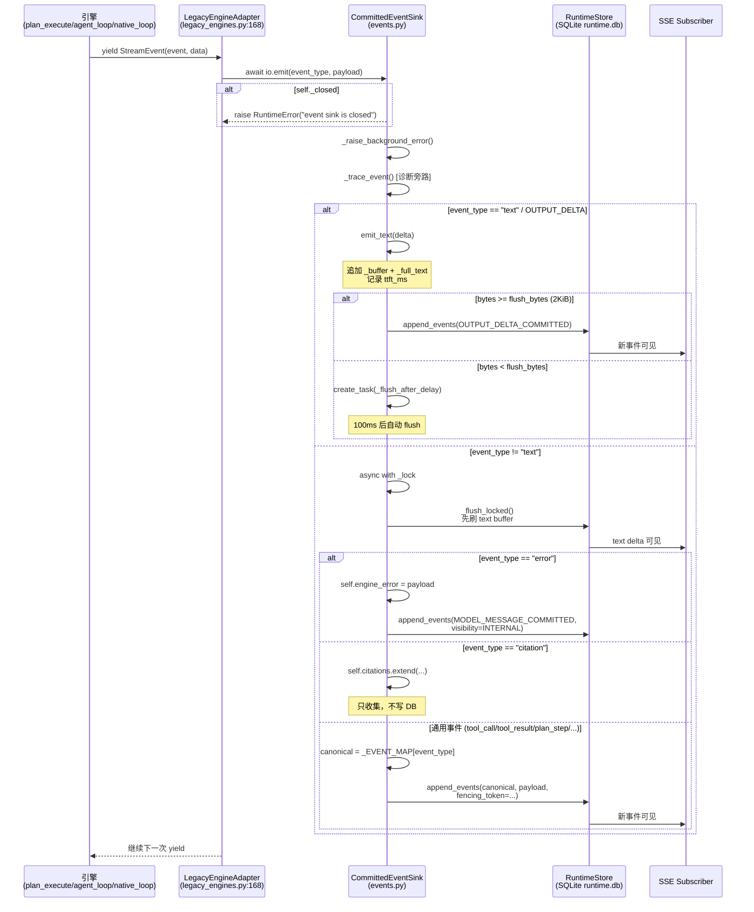

# CommittedEventSink.emit 逐行详解与调用时序

本文档围绕 `agent/runtime/application/events.py:130` 的 `CommittedEventSink.emit` 方法，逐行解释其内部实现逻辑，并给出完整的调用时序图。该方法是三代引擎（`plan_execute`、`agent_loop`、`native_loop`）对外产出事件的**唯一持久化出口**，承载了聚合、分派、诊断旁路与 DB 写入四重职责。

---

## 目录

- [1. 核心定位与设计意图](#1-核心定位与设计意图)
- [2. 调用入口与对象绑定](#2-调用入口与对象绑定)
- [3. emit 逐行解析](#3-emit-逐行解析)
- [4. 关键依赖方法说明](#4-关键依赖方法说明)
- [5. 端到端调用时序图](#5-端到端调用时序图)
- [6. 关键不变量](#6-关键不变量)
- [7. 常见疑问](#7-常见疑问)
- [8. 相关文档](#8-相关文档)

---

## 1. 核心定位与设计意图

### 1.1 三层架构中的位置

```text
┌─────────────────────────────────────────────────────────────────────────────┐
│                         引擎层：只产出事件草稿                               │
│  NativeLoop / AgentLoop / PlanExecute                                       │
│  yield StreamEvent("text", {"delta": "..."})                                │
│  yield StreamEvent("tool_call", {...})                                      │
└───────────────────────────────┬──────────────────────────────────────────────┘
                                │
┌───────────────────────────────▼─────────────────────────────────────────────┐
│                      适配层：LegacyEngineAdapter                            │
│  legacy_engines.py:168                                                      │
│  await io.emit(event.event, event.data)                                     │
│  - Broker 已拥有 tool_call/tool_result → force_flush() + continue          │
│  - 其他事件 → io.emit()                                                     │
└───────────────────────────────┬─────────────────────────────────────────────┘
                                │
┌───────────────────────────────▼─────────────────────────────────────────────┐
│                  持久化层：CommittedEventSink (events.py:55)                 │
│  - text delta：100ms / 2KiB 聚合后写 DB                                    │
│  - tool_call/plan_step/...：立即写 DB                                       │
│  - citation：只收集，terminal 事务统一落库                                   │
│  - error：诊断旁路，不决定终态                                              │
│  - 诊断 Trace 旁路：TTFT + event_counts + answer payload                   │
└─────────────────────────────────────────────────────────────────────────────┘
```

### 1.2 设计意图

- **三代引擎共享同一套持久化语义**：引擎只 `yield` 事件草稿，不接触 DB；避免每个引擎各自实现持久化导致行为不一致。
- **先 commit、后 SSE 可见**：所有事件先写入 `run_events` 表（同一事务内更新 `runs.next_seq`），再由 SSE 订阅者可见，避免断线重连丢事件。
- **text 走聚合，非 text 走即时**：模型流式输出一次回答几百个 delta，逐条写 DB 代价过高；非 text 事件（tool_call 等）是事实，必须即时持久化。
- **诊断与业务分离**：Trace 旁路只记计数/关键字段，绝不参与提交语义。

---

## 2. 调用入口与对象绑定

### 2.1 `io` 的实际类型

`RuntimeIO` 是 `agent/runtime/ports/engine.py:26` 定义的 **Protocol**（鸭子类型接口）：

```python
class RuntimeIO(Protocol):
    async def emit(self, event_type: str, payload: dict[str, Any]) -> None: ...
    async def force_flush(self) -> None: ...
    async def checkpoint(...) -> CheckpointRecord: ...
    async def is_cancelled(self) -> bool: ...
    def remaining_ms(self) -> int: ...
    def seed_assistant_text(self, text: str) -> None: ...
```

实际实现类为 `agent/runtime/application/events.py:55` 的 **`CommittedEventSink`**。

### 2.2 绑定位置

`agent/runtime/application/coordinator.py:329`：

```python
io = CommittedEventSink(
    self.store,
    run_id=run.envelope.run_id,
    activity_id=activity.activity_id,
    fencing_token=activity.fencing_token,
    deadline_at_ms=run.envelope.deadline_at,
    flush_ms=self.event_flush_ms,
    flush_bytes=self.event_flush_bytes,
    clock=self.clock,
)
```

随后在 377 行传入适配器：

```python
outcome = await adapter.execute(request, io)
```

适配器内部（如 `LegacyEngineAdapter.execute`）接收 `io: RuntimeIO`，最终到达 `legacy_engines.py:168`：

```python
await io.emit(event.event, event.data)
```

---

## 3. emit 逐行解析

```python
async def emit(self, event_type: str, payload: dict[str, Any]) -> None:
```

### 3.1 关闭态检查（134-135）

```python
if self._closed:
    raise RuntimeError("event sink is closed")
```

**意图**：如果 `close()` 已被调用（attempt 结束），立即拒绝新事件。防止引擎在 attempt 结束后继续写事件，避免事件流污染下一次 attempt。

### 3.2 后台错误传播（136）

```python
self._raise_background_error()
```

**意图**：定时器 flush 协程（`_flush_after_delay`）中的异常会被记录到 `_background_error`。此处将其上抛给引擎协程，让引擎感知到 DB 写入失败，而非静默丢数据。

**实现**：
```python
def _raise_background_error(self) -> None:
    if self._background_error is not None:
        error = self._background_error
        self._background_error = None
        raise error
```

### 3.3 诊断 Trace 埋点（138）

```python
self._trace_event(str(event_type), payload)
```

**意图**：在 `_span` 上记录事件（计数 + 关键字段），仅影响诊断 Trace，不影响提交语义。`text` 不在 `_TRACED_EVENTS` 中，走 TTFT + 计数替代。

**实现**：
```python
def _trace_event(self, event_type: str, payload: dict[str, Any]) -> None:
    self.event_counts[event_type] = self.event_counts.get(event_type, 0) + 1
    if event_type == "error":
        self.had_error = True
    if self._span is None or event_type not in _TRACED_EVENTS:
        return
    self._span.add_event(event_type, **_traced_fields(event_type, payload))
```

### 3.4 text 分支：走聚合缓冲（139-141）

```python
if event_type in {"text", EventType.OUTPUT_DELTA_COMMITTED}:
    await self.emit_text(str(payload.get("delta", "")))
    return
```

**意图**：模型流式输出的文本 delta 走单独路径，按 100ms/2KiB 聚合后再写 DB，避免每个 delta 都写一次。

`emit_text` 内部逻辑：
```python
async def emit_text(self, delta: str) -> None:
    if not delta:
        return
    if self.ttft_ms is None:
        self.ttft_ms = round((time.monotonic() - self._trace_started) * 1000, 1)
    async with self._lock:
        self._buffer.append(delta)
        self._full_text.append(delta)
        self._buffer_bytes += len(delta.encode("utf-8"))
        if self._buffer_bytes >= self.flush_bytes:
            await self._flush_locked()
        elif self._timer is None:
            self._timer = asyncio.create_task(self._flush_after_delay())
```

- **首个 delta**：记录 `ttft_ms`（Time To First Token）
- **追加到 `_buffer` + `_full_text`**：前者用于聚合写入，后者用于最终拼接完整回答
- **bytes >= flush_bytes（2KiB）**：立即 flush
- **bytes < flush_bytes**：启动 100ms 定时器，到期后自动 flush

### 3.5 加锁（142）

```python
async with self._lock:
```

**意图**：非 text 事件（tool_call、plan_step、error 等）走锁保护的同步写入路径。锁保证 flush text buffer 和写入新事件之间的顺序——模型流输出必须在 ToolCall 事实之前完成持久化。

### 3.6 Flush text buffer（143）

```python
await self._flush_locked()
```

**意图**：先把积攒的 text delta 刷入 DB（`OUTPUT_DELTA_COMMITTED`），确保 100ms/2KiB 聚合的文本在后续 ToolCall/ToolResult 之前有序提交。

**实现**：
```python
async def _flush_locked(self) -> None:
    if not self._buffer:
        return
    text = "".join(self._buffer)
    self._buffer.clear()
    self._buffer_bytes = 0
    timer = self._timer
    self._timer = None
    if timer is not None and timer is not asyncio.current_task():
        timer.cancel()
    await self.store.append_events(
        self.run_id,
        [EventDraft(
            EventType.OUTPUT_DELTA_COMMITTED,
            {"delta": text},
            activity_id=self.activity_id,
            producer="engine",
            occurred_at=self.clock.now_ms(),
        )],
        activity_id=self.activity_id,
        fencing_token=self.fencing_token,
        now_ms=self.clock.now_ms(),
    )
```

### 3.7 error 事件（144-162）

```python
if event_type == "error":
    self.engine_error = dict(payload)
    await self.store.append_events(
        self.run_id,
        [EventDraft(
            EventType.MODEL_MESSAGE_COMMITTED,
            {"engine_error": payload},
            activity_id=self.activity_id,
            visibility=Visibility.INTERNAL,
            occurred_at=self.clock.now_ms(),
        )],
        activity_id=self.activity_id,
        fencing_token=self.fencing_token,
        now_ms=self.clock.now_ms(),
    )
    return
```

**意图**：
- 记录到 `engine_error`，Coordinator 后续检查它是否和 `outcome.kind=COMPLETED` 矛盾（若矛盾则视为失败）
- 以 `MODEL_MESSAGE_COMMITTED` + `visibility=INTERNAL` 写入 DB
- 它是诊断事件，不是公开投递事件，不决定终态

### 3.8 citation 事件（163-165）

```python
if event_type == "citation":
    self.citations.extend(payload.get("citations") or [])
    return
```

**意图**：引用信息只收集到内存，不立即写 DB。最终由 terminal 提交时一起落库（final assistant + citation + success terminal 同一事务）。

### 3.9 通用事件提交（166-178）

```python
canonical = _EVENT_MAP.get(event_type)
if canonical is None:
    canonical = EventType(event_type)
await self.store.append_events(
    self.run_id,
    [EventDraft(
        canonical, dict(payload), activity_id=self.activity_id,
        producer="engine", occurred_at=self.clock.now_ms(),
    )],
    activity_id=self.activity_id,
    fencing_token=self.fencing_token,
    now_ms=self.clock.now_ms(),
)
```

**意图**：
- 通过 `_EVENT_MAP` 将引擎内部事件名映射为规范 `EventType`
- 未知类型直接构造 `EventType`
- 调用 `store.append_events()` 写入 `run_events` 表，带 `fencing_token` 做所有权校验

**事件映射表**：
```python
_EVENT_MAP: dict[str, EventType] = {
    "tool_call": EventType.TOOL_CALL_COMMITTED,
    "tool_result": EventType.TOOL_RESULT_COMMITTED,
    "plan_step": EventType.MODEL_PLAN_UPDATED,
    "skill_event": EventType.SKILL_UI_FRAME_COMMITTED,
    "retrieval": EventType.RETRIEVAL_COMMITTED,
}
```

---

## 4. 关键依赖方法说明

### 4.1 `_flush_locked()`（222-244）

已持锁，将 `_buffer` 中的 text delta 聚合为一次 `OUTPUT_DELTA_COMMITTED` 写入。取消定时器，避免重复 flush。

### 4.2 `_flush_after_delay()`（211-220）

100ms 后自动 flush。异常记录到 `_background_error`，下次 `emit` / `force_flush` / `close` 时上抛。

### 4.3 `store.append_events()`

写入 `run_events` 表，更新 `runs.next_seq`，同一事务内完成。SSE 订阅者通过 `after_seq` 查询新事件。

---

## 5. 端到端调用时序图



---

## 6. 关键不变量

1. **先 commit、后 SSE 可见**：所有事件先写入 `run_events` 表（同一事务内更新 `runs.next_seq`），再由 SSE 订阅者可见，避免断线重连丢事件。

2. **text 走聚合，非 text 走即时**：模型流式输出一次回答几百个 delta，逐条写 DB 代价过高；非 text 事件（tool_call 等）是事实，必须即时持久化。

3. **非 text 先 flush text**：保证模型流输出在 ToolCall 事实之前有序提交，避免顺序错乱。

4. **citation 只收集**：等 terminal 事务一起落库（final assistant + citation + success terminal 同一事务）。

5. **error 是诊断**：不决定终态，Coordinator 后续检查它是否和 `outcome.kind=COMPLETED` 矛盾，若矛盾则视为失败。

6. **诊断与业务分离**：Trace 旁路只记计数/关键字段，绝不参与提交语义。

7. **fencing_token 校验**：所有 `append_events` 调用都带 `fencing_token`，保证只有当前 lease 持有者能写入事件。

8. **后台错误上抛**：定时器 flush 协程中的异常会被记录到 `_background_error`，下次 `emit` / `force_flush` / `close` 时上抛，避免静默丢数据。

---

## 7. 常见疑问

### 7.1 为什么 text 不直接写 DB？

一次回答会产生几百个 delta，每个 delta 都写一次 DB 会导致：
- 事务开销过大
- SSE 可见性过于碎片化
- 磁盘 I/O 压力

聚合为 100ms/2KiB 一次写入，兼顾实时性和性能。

### 7.2 为什么 citation 不立即写 DB？

citation 需要和 final assistant + success terminal 在同一事务内落库，保证三者原子性。如果 citation 单独写 DB，后续 terminal 提交失败会导致引用悬空。

### 7.3 为什么 error 不决定终态？

error 是引擎内部的诊断信息，可能是可恢复的（如临时网络抖动）。Coordinator 会结合 `EngineOutcome` 综合判断：如果 `outcome.kind=COMPLETED` 但有 error，则视为矛盾，强制失败。

### 7.4 为什么非 text 要先 flush text？

假设模型先输出 "我来调用工具"，然后产出 ToolCall。如果 ToolCall 先写 DB，SSE 订阅者会先看到 ToolCall，再看到 "我来调用工具"，顺序错乱。先 flush text 保证 "我来调用工具" 先落库，ToolCall 后落库，顺序正确。

### 7.5 fencing_token 的作用？

Worker 领取 Activity 时获得 `fencing_token`，后续所有事件写入都带此 token。Store 层校验 token 是否匹配，防止旧 Worker（已失去 lease）继续写入事件，保证事件流的单写者语义。

---

## 8. 相关文档

- [事件持久化与 SSE 可见性的分层设计](./事件持久化与SSE可见性的分层设计.md)
- [SSE 流式输出端到端全链路指南](./SSE流式输出端到端全链路指南.md)
- [ToolBroker 详解：效应感知的持久化工具调度协议](./ToolBroker%20详解：效应感知的持久化工具调度协议.md)
- [NativeLoop LLM 流式调用全链路详解](./NativeLoop%20LLM流式调用全链路详解.md)

---

## 源码位置索引

| 概念 | 文件路径 | 行号 |
|---|---|---|
| `RuntimeIO` Protocol | `agent/runtime/ports/engine.py` | 26 |
| `CommittedEventSink` 类定义 | `agent/runtime/application/events.py` | 55 |
| `emit` 方法 | `agent/runtime/application/events.py` | 130 |
| `emit_text` 方法 | `agent/runtime/application/events.py` | 180 |
| `_flush_locked` 方法 | `agent/runtime/application/events.py` | 222 |
| `_flush_after_delay` 方法 | `agent/runtime/application/events.py` | 211 |
| `CommittedEventSink` 实例化 | `agent/runtime/application/coordinator.py` | 329 |
| `adapter.execute(request, io)` 调用 | `agent/runtime/application/coordinator.py` | 377 |
| `io.emit(event.event, event.data)` 调用 | `agent/runtime/adapters/legacy_engines.py` | 168 |
| `_EVENT_MAP` 事件映射 | `agent/runtime/application/events.py` | 18 |
| `_TRACED_EVENTS` 诊断事件集合 | `agent/runtime/application/events.py` | 28 |
