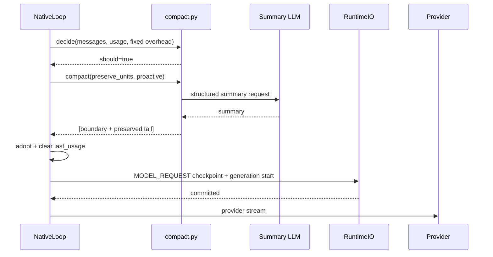
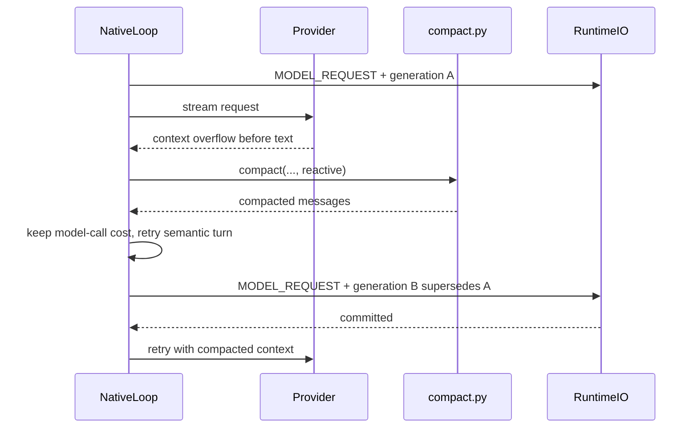

# NativeLoop 上下文压缩全链路详解

> 本文讲解当前 `native_loop` 的 Context Compaction：如何估算请求体积、如何在工具 call/result 原子边界上切分、如何用摘要替换早期历史，以及 provider 报上下文超长时如何安全恢复。

## 1. 压缩要解决的不是“消息太多”这么简单

长循环的 provider 请求体包含：

```text
system instruction
+ 全部工具 JSON Schema
+ 对话 messages
+ assistant tool_calls
+ role=tool results
+ 本轮临时提醒
```

如果只按 `len(messages)` 截断，会同时制造三类问题：

1. 低估上下文。system 和工具 schema 每轮都在，但不在 `state.messages` 中。
2. 破坏线协议。带 `tool_calls` 的 assistant 和紧随的 tool results 是不可拆分单元。
3. 丢失任务状态。直接删早期消息会删掉用户约束、工具结论和未完成待办。

当前实现因此使用“摘要替换早期前缀 + 原样保留近期原子单元”，而不是简单的 sliding window。

## 2. 在生产链路中的位置

```text
NativeLoopAdapter.execute(request, RuntimeIO)
  → 严格恢复 LoopState
  → NativeLoop.run(state)
       ├─ 每轮开始：_maybe_proactive_compact
       ├─ 压缩后保存 MODEL_REQUEST checkpoint
       ├─ provider stream
       └─ ContextOverflowError：_reactive_compact
            → 成功则建立新 generation 再请求
```

压缩算法位于 `agent/engine/native_loop/compact.py`，但两个触发入口和恢复语义位于 `agent/engine/native_loop/loop.py`。消息原子单元位于 `agent/engine/native_loop/messages.py`，压缩后状态通过 `agent/engine/native_loop/checkpoint.py` 的唯一 current codec 持久化。

## 3. 配置与状态

### 3.1 配置

| 配置 | 默认 | 意义 |
|---|---:|---|
| `context_window_tokens` | 128000 | 当前模型的有效窗口 |
| `compact_buffer_tokens` | 13000 | 预留缓冲，触发阈值 = window - buffer |
| `compact_preserve_units` | 6 | 压缩后原样保留的尾部原子单元数 |
| `native_tool_result_max_chars` | 8000 | 每轮请求副本的单条工具结果展示上限 |

启动时必须满足 `compact_buffer_tokens < context_window_tokens`。这些都是 release 语义组件：不同阈值的 Worker 不应恢复同一个 Run。

### 3.2 `LoopState` 中的压缩字段

```text
messages                     当前 kernel 历史
last_usage                   上次 provider 返回的 token usage
attempted_reactive_compact   反应式压缩已消耗次数
compact_failures             压缩失败计数
compact_cooldown             主动压缩冷却剩余 turn
transition                   如 reactive_compact_retry
```

所有字段都进入 current checkpoint。进程重启不会忘记已用反应式预算，也不会绕过冷却。

## 4. Token 估算：真实 usage 和保守估算结合

### 4.1 固定开销

`NativeLoop` 初始化时计算：

```text
fixed_overhead_chars
  = len(system_instruction)
  + len(JSON(tool wire declarations))
```

工具目录在 release 内冻结，所以这一开销只需计算一次，但每轮的体积判定都必须算入。

### 4.2 字符估算

`estimate_tokens` 对 messages 计算：

- 文本 content 长度。
- 多模态 text block 的文本长度。
- 图片只计占位，不把 base64 字符串喂给摘要器。
- ToolCall name 与原始 arguments 字符串。
- 上述固定开销。

再以 `CHARS_PER_TOKEN = 1.5` 换算。这对中文语料偏保守，目标是宁可早压，不要因低估撞上真实上限。

### 4.3 如果 provider 返回 usage

当 `last_usage.prompt_tokens` 可用时：

```text
estimated_tokens = max(last prompt_tokens, current char estimate)
estimated = false
```

用 `max` 的原因是上次 prompt usage 更真实，但本轮又新增了 assistant/tool 消息。如 provider 不支持 stream usage，则纯用字符估算并在日志中标记 `estimated=true`。

阈值决策非常直接：

```text
threshold = max(1, context_window_tokens - compact_buffer_tokens)
should_compact = estimated_tokens >= threshold
```

buffer 用来吸收 tokenizer 差异、provider 隐式包装和摘要后仍需续推的空间，它不是精确 token 数学证明。

## 5. 工具 call/result 为什么必须是原子单元

OpenAI-compatible 消息序列要求：

```text
assistant(tool_calls=[call-A, call-B])
tool(tool_call_id=call-A)
tool(tool_call_id=call-B)
```

如果切分点落在中间，下一轮可能只剩孤立 tool result，provider 会直接拒绝。`messages.atomic_units` 因此将：

- 普通 user/assistant 消息视为单条 Unit；
- 带 tool_calls 的 assistant，以及紧随的所有 role=tool 消息，视为一个不可拆 Unit。

`_preserved_start(messages, preserve_units)` 只能返回 Unit 的 `start`。保留尾部时即使多留一些内容，也不会切坏协议结构。

## 6. 执行一次压缩

`compact.compact` 是一条线性流程：

```text
按原子单元计算 preserved start
  → to_summarize = messages[:start]
  → preserved = messages[start:]
  → render_history(to_summarize)
  → AgentChatClient.complete(结构化摘要 prompt)
  → extract <summary>
  → boundary = Msg(role=user, kind=compact_summary)
  → [boundary, *preserved]
```

### 6.1 摘要输入的体积治理

`render_history` 不是无界拼接：

- system 消息不重复进入摘要。
- 单条消息最多渲染 2000 字符。
- 整段摘要输入最多 60000 字符，超限时优先保留近期内容。
- 图片只渲染为 `[图片]`，不展开 base64。
- tool call 保留工具名和参数摘要，tool result 标出成功/失败。

这一层防止“为了压缩主请求，反而先撑爆摘要请求”。

### 6.2 摘要必须保留哪些事实

摘要 prompt 要求七类信息：

1. 用户请求与约束。
2. 关键概念与术语。
3. 已调用工具及关键结论。
4. 错误、修复与用户纠正。
5. 未完成待办。
6. 压缩前正在做的具体工作。
7. 与最近明确请求相关的下一步。

摘要输出预算为 4096 tokens。首选提取 `<summary>...</summary>`；如模型没有完全按格式输出，会移除显式 analysis 部分后尽量保留全文，目标是宁可多留，不要静默丢信息。

### 6.3 成功结果是替换，不是追加

成功后的状态是：

```text
[一条 compact_summary boundary] + [原样 preserved tail]
```

被摘要的早期 `Msg` 不再保留在 kernel state/checkpoint 中。如果同时保留“旧原文 + 新摘要”，上下文就没有真正缩小，而且会让模型看到重复事实。

boundary 使用 `role=user`、`kind=compact_summary`。`kind` 只是 Native 内部/checkpoint 标记，转为 provider wire message 时仍是普通 user 文本。

## 7. 主动压缩

每个 model turn 开始时，在预留本次 model request 之前运行 `_maybe_proactive_compact`：

```text
control probe
  → hard-cap 检查
  → compact cooldown 检查
  → decide(messages, last_usage, fixed_overhead)
  ├─ should=false: 正常请求
  └─ should=true: compact(..., trigger=proactive)
       ├─ 成功: adopt compacted state
       └─ 失败: 记录失败并进入冷却
  → MODEL_REQUEST checkpoint + generation-start event
  → provider stream
```

压缩没有额外的 checkpoint phase。主动压缩成功后，新 messages 随紧接着的 `MODEL_REQUEST` 一起持久化。在该 checkpoint 提交前不会发起 provider 网络请求。

## 8. 采用压缩结果时为什么要清空 `last_usage`

`_adopt_compacted` 同时执行：

```text
state.messages = compacted
state.last_usage = None
```

如果只替换 messages，旧 `prompt_tokens` 仍然代表压缩前的巨大请求。下一轮 `estimate_tokens` 会取旧 usage 和新字符估算的较大值，导致立即再次压缩。这会：

- 多花一次摘要模型调用；
- 对已经有损的摘要再摘要；
- 进一步丢失早期信息。

清空后暂时回退到字符估算，下次完整 `TurnEnd` 再写入新 usage。

## 9. 反应式压缩与 generation

Provider 在请求阶段报上下文超长时，`NativeLlmClient._classify` 将它转为 `ContextOverflowError`。判定有两层：

1. 共享模型异常分类器识别到 context overflow。
2. 对 provider 措辞未知的 400，如请求字符体积已接近窗口，作为保守的超长旁证。

kernel 捕获后调用 `_reactive_compact`，但必须同时满足：

- 存在摘要用 `AgentChatClient`。
- 本 generation 尚未向 Runtime 提交任何正文 delta。
- `attempted_reactive_compact` 未达上限，默认只允许 1 次。

“尚未输出正文”是防重闸门。如用户已经看到部分文本，在同一内部分支直接压缩并重跑会复制输出；该情况选择如实失败。

反应式压缩成功后：

```text
state.iters -= 1
state.transition = reactive_compact_retry
继续 while
  → model_call_count 不退还
  → 生成新 generation
  → reason = reactive_compact
  → supersedes_generation_id = 上一 generation
  → MODEL_REQUEST checkpoint 提交压缩后状态
  → 再请求 provider
```

`iters` 回退是因为这一轮没有语义上完成；`model_call_count` 不回退是因为 provider 请求确实已经消耗，不能通过超长/崩溃绕过硬上限。

## 10. 压缩失败与冷却

`compact` 在以下情况返回 `None`：

- 尾部保留单元已经覆盖全部历史，没有可摘要前缀。
- 渲染后的可摘要内容为空。
- 摘要模型调用失败。
- 摘要输出为空。

主动压缩失败不立即杀死 Run，而是：

```text
compact_failures += 1
compact_cooldown = 3
```

接下来 3 个 turn 跳过主动压缩，之后可再试。这避免摘要 provider 短暂抖动造成“每轮先失败一次”。

反应式压缩如失败，则原始 context overflow 无法恢复，kernel 以 `CONTEXT_OVERFLOW` 失败收口。反应式次数上限还防止“压缩后仍超长”无限循环。

## 11. 单条大 ToolResult 治理与历史压缩的分工

`_build_request` 先浅拷贝 `state.messages`，再在副本上执行 `apply_tool_result_budget`：

- 只截断超大 role=tool 正文，不删消息。
- 不改变 call/result 数量和配对关系。
- `read_artifact` 允许更大的有界读取展示。
- 只影响本次 provider 视图，不污染 `state.messages`。

两种机制的分工是：

| 机制 | 处理对象 | 是否改变 kernel 历史 |
|---|---|---|
| tool-result budget | 单条巨大结果 | 否，只改请求副本 |
| compaction | 早期整段历史 | 是，用摘要替换前缀 |

在 checkpoint 层还有第三个边界：超过 8 KiB 的 ToolResult 不把正文复制进 checkpoint，而保存 `tool_execution_id`，恢复时通过 Broker/Artifact 重物化。这是持久化体积治理，也不是 compaction。

## 12. Checkpoint 与恢复不变量

Compaction 状态必须满足唯一 current checkpoint codec：

- `kind=compact_summary` 是唯一合法消息 kind 之一，未知值失败关闭。
- 摘要 boundary 与 preserved tail 一起进入当前 phase，不保留另一份压缩前 messages。
- checkpoint 大小默认不得超过 2 MiB UTF-8 bytes，超限报 `CHECKPOINT_TOO_LARGE`。
- checkpoint 存在时不会回退到 canonical history 重建另一个压缩分支。
- `last_usage`、冷却、反应式计数和 generation identity 一起恢复。

压缩不是 Conversation history 的第二写路径。Conversation 的权威仍是 committed USER events 和成功的最终 ASSISTANT event；compact summary 是 Native kernel 为续推保存的 checkpoint 状态。

## 13. 时序图

### 13.1 主动压缩



### 13.2 反应式压缩



## 14. 诚实边界

当前实现有意不提供：

- 精确 tokenizer 计数保证；provider 不返 usage 时仍是估算。
- token 级 deterministic replay；反应式恢复使用新 generation。
- 对单个本身就大于窗口的原子单元进行神奇无损压缩。
- provider 端 tool-use 缓存编辑、microcompact、context-collapse 或 post-compact 文件恢复。
- 摘要内容的语义无损证明；摘要仍是有损 LLM 转换，所以 prompt 倾向宁长勿漏。

## 15. 阅读与调试检查表

看一次压缩 Trace/日志时，建议顺序回答：

1. 是 proactive 还是 reactive？
2. 判定使用真实 usage 还是字符估算？
3. fixed system/tool overhead 是否算入？
4. 切分点是否在 call/result 原子单元边界？
5. 摘要后 `last_usage` 是否清空？
6. 反应式重试前是否已输出正文？
7. 新 generation 是否 supersede 旧 generation？
8. 压缩后状态是否先进 `MODEL_REQUEST` checkpoint，再请求 provider？
9. 压缩失败后是否进入冷却，而不是每轮无限重试？

只要这些问题都有明确答案，就抓住了 Native compaction 的真正生产语义。
