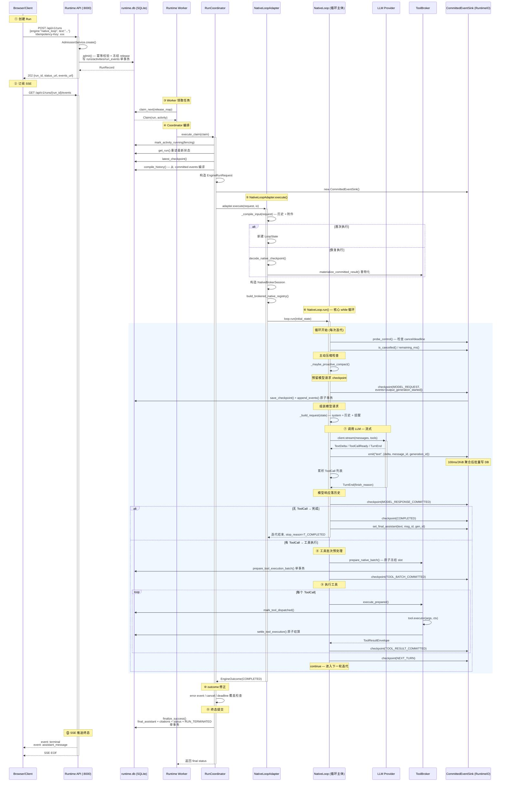

# Native Loop 引擎：Query 到 Answer 全链路代码阅读指南

> 文档基线：当前项目源码。本指南聚焦 `native_loop` 引擎，从一次 HTTP 请求到最终 SSE 输出完整 Answer 的每一步。

## 1. 架构总览

```text
Browser/API Client
  -> POST /api/v1/runs (Idempotency-Key)
  -> Runtime API (:8000)        ← admission, status, SSE
  -> runtime.db + Artifact CAS
  <- Runtime Worker             ← claim + Coordinator + NativeLoopAdapter
       -> ToolBroker -> builtin/Skill/A2A/ClaudeSkill
       -> ARAG (:8100)
       -> LLM Provider (DashScope/OpenAI-compatible)
```

### 四服务五进程

| 进程 | 端口 | 职责 |
|---|---|---|
| `agent.main:app` | :8000 | HTTP admission / status / cancel / SSE / Artifact |
| `agent.runtime.worker.main` | 无 HTTP | 加载 LLM/工具/Skill/A2A，领取并执行 Run |
| `arag.main:app` | :8100 | RAG 检索 + index job |
| `skillcenter.main:app` | :8200 | Skill Center |
| `a2a_service.main:app` | :8300 | A2A 子代理 |

### 核心 Authority

| 问题 | 唯一事实来源 |
|---|---|
| admission / 幂等 | `run_requests` 表 |
| Run 终态 | `runs` 表 + `RUN_TERMINATED` 事件 |
| conversation history | committed USER events + 成功 ASSISTANT events |
| checkpoint | append-only `checkpoints` + revision CAS |
| Tool 副作用 | `tool_executions` 表 |
| Artifact bytes | SHA-256 CAS |
| Evidence | committed EvidenceSet |
| release | immutable manifest + active pointer |

---

## 2. 整体时序图



---

## 3. 代码调用栈图

以下按请求生命周期阶段，从外到内逐层展开。每层标注**关键代码逻辑摘要**和**源码位置**。

### 3.1 接入层 — API 进程启动

```
agent/main.py
├── lifespan()                                    :44  初始化 RuntimeDatabase + SqliteRuntimeStore
│   ├── RuntimeDatabase(path, busy_timeout_ms)    连接 SQLite，启用 WAL/synchronous=FULL/FK/busy_timeout
│   ├── SqliteRuntimeStore(database)               注入 Store 实现
│   ├── store.initialize()                         ensure_current_schema() 校验 schema digest
│   └── FilesystemArtifactStore(artifact_root)     挂载 SHA-256 CAS 文件系统
├── app.include_router(runs_router)                :65  注册 /api/v1/runs 路由
├── app.mount("/chat-ui", ...)                     :68  挂载前端会话 UI
└── app.mount("/trace-ui", ...)                    :70  挂载只读诊断 Trace Console
```

### 3.2 CreateRun — 幂等接纳

```
agent/runtime/api/runs.py
├── create_run()                                   :132  POST /api/v1/runs 入口
│   ├── AdmissionService(store, default_deadline_ms) :139
│   └── service.create(CreateRunInput, idempotency_key) :160
│
agent/runtime/application/admission.py
├── CreateRunInput.digest_payload()                 :26  构造幂等 digest（不含 trace_id）
└── AdmissionService.create()                       :50
    ├── 校验 Idempotency-Key 非空                   :51
    ├── 计算 deadline = now + default_deadline_ms    :54
    ├── digest = sha256_json(request.digest_payload()) :62
    ├── 构造 AdmissionCommand                       :63  含 run_id/activity_id/cancel_token 等 UUID
    └── store.admit(command)                         :83  → SqliteRuntimeStore.admit()

agent/runtime/adapters/sqlite/store.py (Store 层)
└── admit() — 单 BEGIN IMMEDIATE 事务
    ├── 1. 查 (principal_id, agent_id, idempotency_key)  同 digest → 重放旧 Run；不同 digest → 409
    ├── 2. 读 active release pointer                    冻结 exact release fingerprint
    ├── 3. 校验附件 metadata / conversation / 单 conv 非终态 Run
    └── 4. 写 Run + ENGINE_RUN Activity + idempotency/Artifact links + USER/状态 Canonical Events
```

### 3.3 Worker 启动 — build_worker()

```
agent/runtime/worker/main.py
└── build_worker()                                    :38
    ├── RuntimeDatabase + SqliteRuntimeStore.initialize()  初始化 DB
    ├── build_agent_context(settings)                  :49  LLM 配置、内置工具、技能执行器
    ├── attach_skill_tools(context)                    :50  加载 Skill Center 工具
    ├── attach_claude_skill_tools(context)             :51  加载本地 Claude Skill 包
    ├── attach_a2a_agents(context)                     :52  加载 A2A 远程子代理
    ├── build_read_artifact_tool(...)                  :54  构建 Artifact 读取工具
    │
    ├── collect_loop_tools(context, run_engine)        :60  ★ 收集完整工具面
    │   └── agent/engine/loop_tools/catalog.py
    │       └── collect_loop_tools()                   :14
    │           ├── context.tools (builtin + skill + claude + a2a)
    │           ├── update_task_plan                    计划工具
    │           ├── tool_search                         工具发现
    │           ├── build_deferred_tools()              延迟加载工具
    │           └── build_researcher_tool()             子代理工具（native 变体）
    │
    ├── build_registry(native_tools)                   :62  构造 ToolRegistry
    ├── _assert_loop_tool_parity(native, agent_loop)   :64  ★ 两代引擎工具面一致性校验
    │   └── 逐项比较 name/description/parameters/concurrency_safe/exclusive_resources/result_protocol
    ├── build_runtime_tool_catalog(registry)            :65  构造严格 ToolCatalog + digest
    ├── ToolBroker(store, artifact_store)               :70  ★ 效应感知持久化工具调度器
    ├── register_tool_catalog(broker, catalog)          :71  安装到 Broker
    │
    ├── build_release_manifest(engine, ...)             :73  为三个引擎各构建 release manifest
    ├── activate_current_releases(manifests)           :101 原子切换三份 active pointer
    │
    ├── AdkEngineAdapter("plan_execute"/"agent_loop")  :81  ADK 引擎适配器 ×2
    ├── NativeLoopAdapter(...)                          :91  ★ Native 引擎适配器
    ├── EngineRegistry(adapters)                        :102
    └── RunCoordinator(store, registry, ...)            :103  核心编排器
```

### 3.4 Worker 领取 — RuntimeWorker

```
agent/runtime/worker/dispatcher.py
└── RuntimeWorker.run()                                 :57
    ├── heartbeat_worker("ACTIVE")                      :58  Worker 心跳上线
    └── while not self._stop:
        ├── _maintenance(now)                           :70  后台家务
        │   ├── fire_due_timers()                       触发到期重试
        │   ├── recover_expired()                       回收过期 lease
        │   ├── expire_deadlines()                      deadline 超时判定
        │   ├── artifact_store.cleanup_orphans()        Artifact GC
        │   └── heartbeat_worker("ACTIVE")              每 5s 心跳
        │
        ├── store.claim_next(worker_id, release_map)    :72  ★ 精确匹配 (engine, release_fingerprint) 领取
        │
        └── asyncio.create_task(_execute(claim))        :80
            ├── attempt = coordinator.execute_claim(claim) :153 实际执行
            └── renewal = _renew_lease(claim, ...)      :156 并行 lease 续约
```

### 3.5 Coordinator — 核心编排

```
agent/runtime/application/coordinator.py
└── RunCoordinator.execute_claim(claim)                  :78
    │
    │  ── 恢复 trace_id ──
    ├── use_trace_id(claim.run.trace_id)                 :87  Worker 进程恢复诊断轨迹
    │
    │  ── Step 1: Activity → RUNNING ──
    ├── store.mark_activity_running(fencing)             :98  CAS，stale fence → AttemptOwnershipLost
    │
    │  ── Step 2: 重读 Run ──
    ├── store.get_run(run_id)                            :106 取最新状态，可能已被 cancel
    │
    │  ── Step 3: 解析 reconcile marker ──
    ├── ToolReconciliationMarker.parse_exact()           :109 严格解析 resume_payload
    │
    │  ── 分支: reconcile-only ──
    ├── tool_reconciler.reconcile_only()                 :183 仅查询 effect 状态，不跑引擎
    ├── store.settle_reconciliation_query()               :193 单事务裁决
    │
    │  ── 分支: cancel before engine ──
    ├── store.finalize_failure(CANCELLED/TIMED_OUT)      :134 取消或超时直接结束
    │
    │  ── Step 4: 引擎执行准备 ──
    ├── registry.get(engine)                             :205 取 NativeLoopAdapter
    ├── adapter.release_fingerprint 校验                  :209 release 防御断言
    ├── store.latest_checkpoint(run_id)                  :222 拉最新 checkpoint
    ├── deadline 检查                                    :225 进引擎前最后超时门禁
    ├── store.compile_history(run_id)                    :239 ★ 从 committed events 编译历史
    │
    │  ── Step 5: 构造 RuntimeIO ──
    ├── CommittedEventSink(store, run_id, ...)           :254 ★ 三代引擎唯一出口
    │   ├── flush_ms=100, flush_bytes=2048              100ms/2KiB 聚合
    │   ├── tool_broker=broker                           注入 Broker
    │   └── deadline_at_ms                               deadline 向下传递
    │
    │  ── Step 6: 引擎执行 ──
    ├── adapter.execute(request, io)                     :288 ★ 三代引擎统一调用点
    │
    │  ── Step 7: 三道 outcome 修正 ──
    ├── io.engine_error 覆盖 COMPLETED                   :345 矛盾按失败处理
    ├── is_cancel_requested → CANCELLED                  :353 取消权威在库
    ├── deadline 已过 → DEADLINE_EXCEEDED                :357 超时排取消之后
    │
    │  ── Step 8: 终态提交 ──
    ├── COMPLETED + unresolved → wait_for_input          :374 未决 effect → 人工协调
    ├── COMPLETED + clean → finalize_success              :394 ★ final assistant + citation + 成功终态 单事务
    ├── RETRYABLE_FAILURE → schedule_retry               :423 指数退避 + 抖动
    └── else → finalize_failure(CANCELLED/FAILED/TIMED_OUT) :449 含 sticky pending_terminal 逻辑
```

### 3.6 NativeLoopAdapter — 引擎适配器

```
agent/engine/native_loop/engine.py
└── NativeLoopAdapter.execute(request, io)                :122
    │
    │  ── 编译输入 ──
    ├── _compile_input(request)                          :487
    │   ├── 从 request.history 构建历史 Msg 列表          :488-491
    │   ├── 附件处理:
    │   │   ├── image/* → base64 编码 → image_url block   :499-505
    │   │   └── 其他 → read_preview → text block          :507-521
    │   └── 返回 [user_msg_with_attachments]              :533
    │
    │  ── 恢复 or 新建 ──
    ├── checkpoint is None → LoopState(messages)         :128 首次
    ├── checkpoint exists:
    │   ├── decode_native_checkpoint(engine_state)        :138  ★ strict current codec
    │   │   └── NativeCheckpointState.model_validate(strict=True)
    │   │       + _validate_message_sequence()            校验 ToolCall/ToolResult 配对完整性
    │   └── _materialize_ledger_results(state, ...)       :142 重物化所有已提交 ToolResult
    │       └── broker.materialize_committed_result()     从 ToolExecution + Artifact CAS 恢复
    │
    │  ── 构造 Broker 会话 ──
    ├── NativeBrokerSession(run_id, activity_id, ...)    :145
    ├── build_brokered_native_registry(registry, session) :158 ★ 包装工具，绑定 Broker slot
    │   └── agent/runtime/adapters/brokered_tools.py
    │       └── build_brokered_native_registry()          :651
    │           └── 每个 ToolSpec 包装 run() → broker.execute_prepared()
    │
    │  ── checkpoint hook (persist) ──
    ├── persist(state, phase, events)                    :160
    │   ├── encode_native_checkpoint(state, phase)        :166 序列化 + 校验
    │   ├── 计算 model_plan from tool_state               :180 计划进度投影
    │   └── io.checkpoint(working_state, engine_state, events) :198 → Store 原子提交
    │
    │  ── 工具批处理 hook ──
    ├── prepare_batch(calls, state)                      :216
    │   └── prepare_native_batch(session, registry, batch) :229 → Broker.prepare_batch()
    │
    │  ── 单工具执行 hook ──
    ├── execute_one(call, state)                         :234
    │   └── executor.execute_one(call, brokered_registry, ...) :236
    │
    │  ── 批量工具执行 hook ──
    ├── run_calls(calls, state, max_concurrency)          :256
    │   ├── begin_native_settlement_batch(session, calls) :259 有序结算
    │   └── executor.run_calls(calls, brokered_registry, ...) :260
    │
    │  ── 控制探测 hook ──
    ├── probe_control()                                  :280
    │   ├── io.remaining_ms() <= 0 → TimeoutError
    │   └── io.is_cancelled() → NativeRunCancelled
    │
    │  ── 恢复特殊阶段 ──
    ├── MODEL_RESPONSE_COMMITTED 恢复                    :288 完整 final 直接返回
    ├── COMPLETED 恢复                                   :308 set_final_assistant 返回
    │
    │  ── 构造 NativeLoop 并执行 ──
    ├── NativeLoop(client, registry, system, config, ...) :315
    │   ├── checkpoint=persist                           hook: 持久化
    │   ├── prepare_tool_batch=prepare_batch             hook: 批次预处理
    │   ├── run_tool_calls=run_calls                     hook: 批量执行
    │   ├── execute_tool=execute_one                     hook: 单工具执行
    │   ├── control_probe=probe_control                  hook: 取消/超时
    │   └── config=LoopConfig(...)                       :328 硬限配置
    │
    │  ── stream pump ──
    ├── loop.run(initial_state=state)                    :361 → AsyncIterator[StreamEvent]
    ├── pump_stream() task                               :370 每帧 await io.emit() 才拉下一帧
    ├── watch_cancel() task                              :390 按 attempt 存活，0.1s 轮询
    └── while stream 未耗尽:
        ├── await stream_ready.wait()
        ├── await io.emit(event.event, event.data)       :434 ★ 顺序 + 背压
        └── stream_acknowledged.set()
```

### 3.7 NativeLoop — 核心 while 循环

```
agent/engine/native_loop/loop.py
└── NativeLoop.run(initial_state)                         :277  → AsyncIterator[StreamEvent]
    │
    ├── probe_control()                                   :305 取消/超时预检
    ├── _resume_pending_tools(state)                      :309 恢复未完成的 ToolResult 配对
    │
    └── while True:                                       :312 ★ 自研循环核心
        ├── probe_control()                               :313
        ├── state.iters += 1
        │
        ├── ── 硬熔断 ──
        │   model_call_count >= hard_cap → fail           :317 崩溃不退款
        │
        ├── with start_span("native.turn", ...)           :334 turn span（工具 span 挂其下）
        │
        ├── ── 主动压缩 ──
        │   _maybe_proactive_compact(state)               :336
        │   └── compact.decide() → tokens >= threshold?
        │       └── compact.compact(messages, chat)       摘要模型一次 LLM 调用
        │           └── [摘要] + preserved_tail → 替换历史
        │
        ├── ── 预留模型请求 checkpoint ──
        │   state.model_call_count += 1                   :346
        │   state.generation_counter += 1
        │   state.current_message_id = factory(iters-1)   :348
        │   state.current_generation_id = gen_{uuid}      :358
        │   checkpoint(state, "MODEL_REQUEST",             :362
        │       events=[output_generation_started])        → Store 原子事务
        │
        ├── ── 组装模型请求 ──
        │   _build_request(state)                         :748
        │   ├── clone(messages)                           浅拷贝，体积治理不污染原始历史
        │   ├── apply_tool_result_budget(live, max_chars) 截断超长 tool 消息
        │   ├── [system_instruction, *live]                system 指令 + 历史
        │   ├── +PLAN_CONTINUATION_REMINDER                计划未完成时注入续推提醒
        │   └── +FORCE_SUMMARY_REMINDER                    max_iters 到达时软收尾
        │
        ├── ── 调模型: 流式 ──
        │   client.stream(messages, tools)                :401
        │   ├── TextDelta → yield StreamEvent("text")     :424
        │   ├── ToolCallReady → ready_calls.append()      :438
        │   │   ├── logical_key = "native:turn:N:call:M"  :434 稳定 slot
        │   │   ├── _check_call_limits()                  :437 超限检查
        │   │   ├── 早期派发? → early_scheduler.submit()  :446 并发安全 + 参数合法
        │   │   └── 否则 → deferred_calls                 :454
        │   └── TurnEnd → finish_reason, usage            :456
        │
        ├── ── 异常处理 ──
        │   ├── ContextOverflowError → _reactive_compact → continue :466 恢复优先于失败
        │   ├── NativeLlmError → _fail(T_MODEL_ERROR) → return :485
        │   └── BaseException → cancel early → raise      :494
        │
        ├── ── 模型响应固化 ──
        │   state.messages.append(assistant(text, calls)) :520
        │   _validate_finish_reason(finish_reason, ...)   :526
        │   │   stop → 无 ToolCall + 非空 text
        │   │   tool_calls → 完整 batch + id 唯一
        │   checkpoint(state, "MODEL_RESPONSE_COMMITTED")  :563
        │
        ├── ── 唯一退出判定 ──
        │   if not ready_calls:                           :566
        │   │   state.final_text = text
        │   │   checkpoint(state, "COMPLETED")
        │   │   _complete(state) → return
        │
        ├── ── 工具批次 ──
        │   _prepare_tool_batch(ready_calls, state)        :584 → Broker.prepare_batch()
        │   checkpoint(state, "TOOL_BATCH_COMMITTED")      :588
        │
        │   ── 收集工具结果 ──
        │   ├── early_results 回收                          :595 提前派发的
        │   │   └── for each: yield result_events → checkpoint
        │   └── _run_calls(deferred_calls, state)          :602 延迟的
        │       └── for each: yield result_events → checkpoint
        │
        └── checkpoint(state, "NEXT_TURN")                :622 → continue
```

### 3.8 LLM 客户端 — 流式调用

```
agent/engine/native_loop/llm_client.py
└── NativeLlmClient.stream(messages, tools)               :263
    ├── open_span("native.llm", KIND_LLM)                 :303 不压 contextvar（工具 span 挂 turn 下）
    ├── payload = {model, messages: to_wire(), stream:true, temperature:0.2}
    ├── _consume(payload, ...)                             :365
    │   └── _ToolCallAccumulator(max_calls, max_argument_bytes)
    │
    ├── async with client.chat.completions.create(**payload) as stream:  :386 OpenAI SSE
    │   └── async for chunk in stream:
    │       ├── delta.content → yield TextDelta            :424
    │       ├── delta.tool_calls[i]:
    │       │   ├── accumulator.add(index, id, name, arguments) :454 分片累积
    │       │   │   └── id/name 取首次非空; arguments 字符串拼接
    │       │   └── accumulator.take_ready(allow_early)    :460
    │       │       └── index < max_index && is_parseable() → yield ToolCallReady
    │       └── finish_reason → finish_seen = True
    │
    ├── 流结束:
    │   ├── 校验 finish_reason 存在                         :467
    │   ├── accumulator.take_remaining() → yield ToolCallReady :472
    │   └── yield TurnEnd(finish_reason, usage)            :474
    │
    └── 异常分类:
        ├── openai.BadRequestError → _classify()           :323
        │   ├── keywords match → ContextOverflowError
        │   └── request_chars >= threshold → ContextOverflowError 体积兜底
        └── other Exception → _classify() → NativeLlmError :337
```

### 3.9 工具执行 — Tool Broker

```
agent/runtime/application/tool_broker.py
└── ToolBroker
    │
    ├── prepare_batch(calls)                               :250 原子冻结 slot
    │   └── store.prepare_tool_execution_batch()           单事务写 PREPARED + TOOL_CALL_COMMITTED
    │
    ├── execute_prepared(prepared, ...)                    :298 执行一个已冻结 slot
    │   ├── _resolve_tool(tool_name)                       查找注册
    │   ├── store.get_tool_execution()                     读取 ledger
    │   ├── 校验 logical_key/tool_name/request_digest/release_digest :322-327 mismatch → TOOL_REPLAY_MISMATCH
    │   └── _execute_ledger(tool, execution, ...)          :715 ★ 状态机循环
    │       │
    │       ├── COMMITTED → 直接返回                        :744
    │       ├── MANUAL_REQUIRED → 返回 UNKNOWN              :753
    │       ├── FAILED + (MANUAL_FAILED/unsafe/max_attempts) → 返回 :762
    │       ├── DISPATCHED/UNKNOWN/RECONCILING → reconcile :770
    │       │
    │       ├── mark_tool_dispatched()                     :838 → 状态转 DISPATCHED
    │       ├── deadline 检查                              :844
    │       ├── tool.executor(args, ctx)                   :869 ★ 实际调用
    │       │   └── NativeBrokerSession 中包装的 run() → spec.run(args, ctx)
    │       │
    │       ├── AttemptOwnershipLost → 原样冒泡              :872 不结算 ledger
    │       ├── TimeoutError → _settle_dispatch_failure     :878
    │       │   └── READ_ONLY → FAILED; 其他 → UNKNOWN
    │       ├── RuntimeFault → raise_if_ownership_lost + settle :884
    │       ├── Exception → settle_dispatch_failure        :928
    │       └── 成功:
    │           ├── _adapt_execution_output() → ToolExecutionOutput :936
    │           ├── 校验 EvidenceSet identity               :1059
    │           └── _commit_result()                        :957 → Store 原子结算
    │               ├── 大结果 → Artifact CAS               :1304
    │               ├── knowledge_search → EvidenceSet Artifact :1274
    │               └── store.settle_tool_execution()       :1348 COMMITTED 事务
    │
    └── _commit_result(execution, result, evidence)         :1262
        ├── evidence → Artifact("application/vnd.sxw.evidence-set+json")
        ├── 大结果 → Artifact("application/json") + preview 截断
        └── store.settle_tool_execution(effect_status="COMMITTED")
```

### 3.10 Native 工具 Registry + Executor

```
agent/engine/native_loop/executor.py
└── execute_one(call, registry, ...)                        :127 单工具执行
    ├── spec = registry.get(call.name)                     :139
    │   └── None → _error_outcome("NoSuchTool")            :143
    ├── parse_arguments(call)                              :149
    │   └── 解析失败 → _error_outcome("ToolArgumentsParseError") :155
    ├── call_tool(spec, args, ctx)                         :168
    │   └── spec.run(args, ctx)                            → 实际工具函数
    ├── CancelledError → raise                             :169
    ├── AttemptOwnershipLost → raise                       :171 控制流，不进模型
    ├── RuntimeFault → raise                               :174 同上
    └── Exception → _error_outcome(feedback to model)      :180 ★ 工具异常喂回模型

└── run_calls(calls, registry, ...)                         :240 批量执行
    └── partition(calls, registry)                          :249 ★ CC 式分批
        ├── 连续 concurrency_safe 工具 → Batch(concurrent=True)
        └── 其他 → Batch(concurrent=False) 每工具一批
        然后:
        ├── 串行批次 → 逐个 execute_one
        └── 并发批次 → asyncio.Semaphore(max_concurrency) + create_task
            └── 按调用顺序回收结果，first_failure 检测控制异常

agent/engine/native_loop/tools.py
├── ToolSpec(name, description, parameters, run, ...)      :56 统一工具契约
├── ToolRegistry(specs)                                     :81 按名字查 + Draft202012 校验
├── from_function(fn)                                       :124 普通函数 → ToolSpec
│   ├── inspect.signature + typing.get_type_hints → JSON Schema
│   ├── _parse_docstring() → 摘要 + Args 段
│   └── concurrency_safe = name in _READ_ONLY_TOOLS
├── from_adk_tool(tool)                                     :264 ADK BaseTool → ToolSpec
│   └── tool._get_declaration() → parameters_json_schema / parameters
├── build_registry(tools)                                   :361 混合工具列表 → ToolRegistry
│   ├── callable + no run_async → from_function
│   ├── is_agent_tool → from_agent_tool (子代理桥接)
│   └── else → from_adk_tool
└── call_tool(spec, args, ctx)                              :392 spec.run(args, ctx)
```

### 3.11 Checkpoint Codec

```
agent/engine/native_loop/checkpoint.py
├── encode_native_checkpoint(state, phase)                   :317 ★ 序列化 + 校验
│   └── NativeCheckpointState(contract, phase, iters, messages, ...)
│       └── model_validator → validate_kernel_invariants    :139
│           ├── messages 非空
│           ├── model_call_count == generation_counter
│           ├── logical_keys 唯一
│           ├── tool_state JSON 确定
│           ├── _validate_message_sequence(messages, phase)  :198 ToolCall/Result 配对校验
│           └── COMPLETED: final_text/final_message_id/final_generation_id 一致
│
├── decode_native_checkpoint(raw, current_input)            :369 ★ 严格解码
│   └── NativeCheckpointState.model_validate(raw, strict=True) :376
│       ├── 不满足 → NATIVE_CHECKPOINT_INVALID
│       ├── MODEL_REQUEST → iters -= 1, resume_from_model_request :440-444
│       │   (崩溃不退款，同 message_id 新 generation)
│       └── 重建 LoopState + messages
│
└── NativeCheckpointState phases:
    MODEL_REQUEST → MODEL_RESPONSE_COMMITTED → TOOL_BATCH_COMMITTED
    → TOOL_RESULT_COMMITTED → NEXT_TURN → COMPLETED
```

### 3.12 CommittedEventSink — RuntimeIO

```
agent/runtime/application/events.py
└── CommittedEventSink                                      :58 引擎唯一对外出口
    │
    ├── emit(event_type, payload)                           :167
    │   ├── text → emit_text()                              :177 delta 走聚合
    │   ├── 非 text → lock 保护:
    │   │   ├── _flush_locked() 先刷 text buffer            :186
    │   │   ├── skill_event → 预算检查 + 配额追踪           :187
    │   │   ├── error → engine_error 记录 + Internal event  :208
    │   │   ├── citation → 内存列表（不进 DB，Store finalize 独立派生） :227
    │   │   └── _EVENT_MAP 映射 → store.append_events()     :237
    │
    ├── emit_text(delta, message_id, generation_id)         :248
    │   ├── ttft_ms 首次记录                                :257
    │   ├── message/generation 切换 → flush                 :260
    │   ├── buffer.append(delta) + full_text.append(delta)   :268-269
    │   ├── buffer_bytes >= flush_bytes → _flush_locked()   :271
    │   └── timer is None → _flush_after_delay(100ms)       :273
    │
    ├── _flush_locked()                                     :358
    │   └── store.append_events([EventDraft(OUTPUT_DELTA_COMMITTED, {delta: text})])
    │       带 fencing_token，原子写入 run_events
    │
    ├── checkpoint(working_state, expected_revision, ...)   :396
    │   ├── force_flush()                                   先刷完 text buffer
    │   └── store.save_checkpoint()                         ★ 原子提交 checkpoint + 附带 events
    │
    ├── set_final_assistant(text, message_id, generation_id) :151
    │   └── 校验 text 非空 + 幂等
    │
    └── close() / abort()                                   :281 / :293
        ├── close → flush + 关 timer
        └── abort → 清 buffer 不写 Store (ownership lost)
```

### 3.13 SSE — 事件推送

```
agent/runtime/api/runs.py
├── _SSE_EVENT_NAMES                                        :233 事件类型 → SSE event 名称映射
│   OUTPUT_GENERATION_STARTED → text_start
│   OUTPUT_DELTA_COMMITTED → text
│   TOOL_CALL_COMMITTED → tool_call
│   TOOL_RESULT_COMMITTED → tool_result
│   ASSISTANT_MESSAGE_COMMITTED → assistant_message
│   RUN_TERMINATED → terminal
│   ...
│
└── stream_events(run_id, after_seq, last_event_id)         :273
    ├── initial_cursor = after_seq ?? Last-Event-ID         :288
    └── generate():
        ├── store.list_events(run_id, after_seq=cursor)     :295
        ├── for event → yield _sse(event)                   :298
        │   └── f"id: {seq}\nevent: {name}\ndata: {json}\n\n"
        ├── event == RUN_TERMINATED → return                :300
        ├── run.status in TERMINAL + no events → return      :303
        ├── heartbeat (每 N 秒) → ": heartbeat\n\n"          :306
        └── await asyncio.sleep(poll_ms / 1000)             :308
```

---

## 4. 关键设计决策摘要

### 4.1 稳定 Logical Slot

工具调用的 Runtime 身份由 `native:turn:{N}:call:{M}` 派生，而非 provider 生成的 `function_call_id`。恢复时相同 slot 落在同一 `ToolExecution`，mismatch fail closed。

### 4.2 Checkpoint Phase 状态机

```text
MODEL_REQUEST
  → MODEL_RESPONSE_COMMITTED (assistant 消息落历史)
    → TOOL_BATCH_COMMITTED (Broker 原子 PREPARE 整批)
      → TOOL_RESULT_COMMITTED (每结果逐一提交)
        → NEXT_TURN (全部配对完成)
          → [循环 or COMPLETED]
```

每个 phase boundary 都是恢复点。进程崩溃后从最后 committed phase 重放，已完成的效果不重跑。

### 4.3 背压与顺序

Native stream pump 每次只允许一个 event 在途：`await io.emit()` 返回才拉下一帧。`CommittedEventSink` 以 100ms/2KiB 批量提交，在 generation/tool/checkpoint/close 边界 flush。

### 4.4 工具效应分类

| EffectClass | 重试策略 | 典型工具 |
|---|---|---|
| `READ_ONLY` | 安全重试，FAILED 直接结算 | calculator, knowledge_search, read_artifact |
| `IDEMPOTENT_EFFECT` | 传稳定 idempotency key | update_task_plan |
| `UNKNOWN_EFFECT` | 不透明重试，失败进 MANUAL | 未评审的 Skill/A2A |

### 4.5 上下文压缩

- **主动压缩**：`tokens >= (context_window - buffer)` 时摘要
- **反应式压缩**：`ContextOverflowError` → 压缩后重来一轮（`state.iters -= 1`）
- **原子单元**：压缩切分必须对齐 `assistant[tool_calls] + tool[*]` 区间边界
- **体积兜底**：`request_chars >= window × 0.9` 时不认识的 400 按超长处理

---

## 5. 推荐阅读顺序

```text
# 接入层
agent/main.py
agent/runtime/api/runs.py
agent/runtime/application/admission.py

# 基础设施
common/sqlite_schema.py
agent/runtime/adapters/sqlite/store.py (schema + admit/claim/finalize)
agent/runtime/application/events.py (CommittedEventSink)

# Worker + Coordinator
agent/runtime/worker/main.py (build_worker)
agent/runtime/worker/dispatcher.py (RuntimeWorker)
agent/runtime/application/coordinator.py (RunCoordinator)

# Native 引擎核心
agent/engine/native_loop/engine.py (NativeLoopAdapter)
agent/engine/native_loop/loop.py (NativeLoop — ★ 核心 while 循环)
agent/engine/native_loop/llm_client.py (流式 LLM 客户端)
agent/engine/native_loop/messages.py (Msg 模型 + 原子单元)
agent/engine/native_loop/executor.py (工具执行 + 分批调度)
agent/engine/native_loop/checkpoint.py (checkpoint codec)
agent/engine/native_loop/tools.py (ToolSpec/ToolRegistry)
agent/engine/native_loop/compact.py (上下文压缩)

# 工具 Broker + 适配
agent/runtime/application/tool_broker.py (ToolBroker)
agent/runtime/adapters/brokered_tools.py (NativeBrokerSession)

# 共享工具面
agent/engine/loop_tools/__init__.py (LOOP_INSTRUCTION)
agent/engine/loop_tools/catalog.py (collect_loop_tools)

# SSE
agent/runtime/api/runs.py:stream_events
```

---

## 6. 诚实边界

- 当前仅支持单机进程级恢复，不是跨节点 HA。
- Native 不承诺 provider token 级 deterministic replay；恢复从最后 committed checkpoint 重放。
- 上下文压缩在上游不返回 usage 时为字符估算（日志标 `estimated=true`）。
- LocalSandbox 非生产安全隔离。
- Prompt cache 显式断点仅对 Anthropic 生效，默认 DashScope 下为 no-op。
- 早期工具派发（`experimental_heuristic`）仍在实验阶段，默认 `off`。
