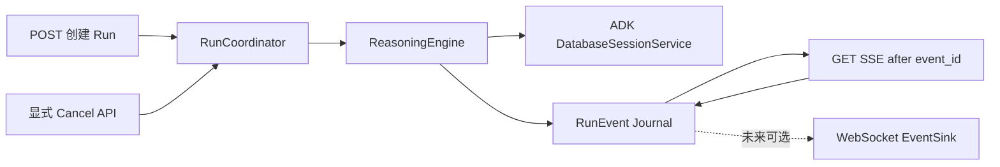

# 会话管理、WebSocket 与 SSE 生产级能力引入评估

> 评估日期：2026-08-06  
> 评估对象：`sxw_agent-2_demo` 及参考项目 `albert-chat-2`  
> 文档性质：只读分析与方案评估，不代表相关能力已经实现  
> 结论摘要：优先建设 SSE 可靠性、持久化 Session 与独立 Run 生命周期；真正的断线续传应建立在后台 RunCoordinator 和事件日志上；WebSocket 暂不应作为当前阶段的默认建设项。

## 1. 背景与评估目标

当前项目已经完整展示了两代 Agent 推理引擎、工具调用、Claude SKILL、A2A、混合召回 RAG、统一 SSE 事件与结构化日志，但接入层仍主要服务于“本机发起一次请求并观看一次流式回答”的演示场景。

参考项目 `albert-chat-2` 承担生产接入层职责，包含较完整的：

- 会话、消息和事件持久化；
- Run 状态、取消与短期事件恢复；
- SSE 心跳、防代理缓冲和超时治理；
- WebSocket 多端推送、连接心跳和集群广播；
- 请求幂等、会话归属校验与多通道投递；
- 流生命周期指标、错误终结与恢复游标。

本次评估的目标不是复制生产项目，而是回答以下问题：

1. 哪些能力能显著增强当前样板工程的 Agent Runtime 主线？
2. 哪些能力可以低成本加入，并形成清晰的面试讲解价值？
3. 哪些能力必须依赖新的架构边界，不能以局部补丁实现？
4. 哪些生产实现包含企业基础设施或历史兼容，不适合搬入本项目？
5. 推荐的分阶段演进路线、验收标准与风险边界是什么？

## 2. 评估范围与方法

### 2.1 当前项目重点检查范围

- `agent/api/chat.py`：SSE 对话入口、请求生命周期和断连语义；
- `agent/session/session_service.py`：ADK SessionService 封装；
- `agent/stream/event_converters.py`：统一流事件及 SSE 序列化；
- `agent/engine/`：两代引擎如何驱动 ADK Runner；
- `agent/skills/stream_merge.py`：Runner 事件与技能 UI 事件的并发合并；
- `common/obs.py`：trace 和 HTTP 访问日志；
- `web/app.js`：浏览器 SSE 解析、终态处理和主动停止；
- `agent/api/documents.py`、`agent/tools/knowledge_search.py`、`arag/`：会话与文档范围的关联程度；
- `requirements.txt`：现有依赖能否直接支持可靠 SSE 和持久化会话。

### 2.2 参考项目重点检查范围

参考路径：

```text
/Users/shixiangweii/IdeaProjects/sxw_work/codes/fy26_albert_chat2/albert-chat-2
```

重点检查了：

- `DialogService`、`MessageService`、`EventService`；
- `RunStreamManager`；
- `RuntimeH5ApiController` 的 chat/cancel/resume/recover；
- `AgentChatService` 的 SSE 心跳与 Run 终结；
- `RuntimeV3AgentService` 的下游 SSE 心跳、游标和续传；
- `ChatRequestDeduplicateService`、`LwpCardChatIdempotencyService`；
- WebSocket Endpoint、Registry、HeartbeatScheduler、PushService；
- `AgentConversationDeliveryService`、`KeyedSerialExecutor`；
- 2026 年 7—8 月的会话归属、双通道投递和 LWP 恢复设计文档。

### 2.3 评估维度

每项能力按以下维度判断：

- 对 Agent Runtime、RAG、可靠性或评测主线的贡献；
- 当前是否存在真实业务场景；
- 实现复杂度和新增基础设施成本；
- 对两代引擎、技能沙箱和取消清理的影响；
- 能否诚实描述能力边界；
- 是否会让样板工程偏离核心学习目标。

## 3. 当前项目基线

### 3.1 当前请求链路

```text
浏览器/curl
  -> POST /api/v1/chat/{agent_uuid}/stream
  -> get_or_create ADK Session
  -> 构造当前引擎
  -> 当前 HTTP 异步生成器直接驱动 ReasoningEngine
  -> ADK Runner 产生模型、工具和技能事件
  -> CitationInjector 补引用事件
  -> 自定义 sse_format 输出文本帧
  -> HTTP 连接结束
```

这条链路的优点是短、直观、取消传播自然，适合展示 Agent Loop；缺点是 Session、Run 和 HTTP 连接尚未解耦。

### 3.2 已具备的正向能力

当前实现并非没有可靠性基础，已经具备：

- 客户端断开会取消生成器，并沿 Runner、技能和沙箱传播；
- `merge_runner_events` 对 Runner 与技能事件做单点合并，避免多写者直接写 HTTP；
- Claude SKILL 对超时、取消和沙箱清理有专门治理；
- 统一事件类型涵盖文本、工具、计划、引用、技能、完成和错误；
- `trace_id` 可透传到下游服务；
- 浏览器支持主动停止当前请求；
- 评测 harness 能解析 SSE 并记录 TTFT、总耗时和错误。

这些能力应被保留，并成为后续 RunCoordinator 和可靠 SSE 的基础。

## 4. 当前差距分析

### 4.1 Session 只是进程内模型上下文

`agent/session/session_service.py` 当前使用 `InMemorySessionService`，只封装：

```text
get_session -> 不存在则 create_session
```

因此存在以下缺口：

- agent 进程重启后上下文丢失；
- 没有会话列表、标题、更新时间、删除和历史查询接口；
- 浏览器刷新后无法恢复会话列表和消息；
- 前端负责生成 `session_id`，服务端没有返回“实际生效的 session”；
- 没有会话归属不存在、已删除或不匹配时的明确策略；
- 没有会话级并发治理；
- 会话与 Run、消息气泡、UI 事件之间没有显式模型。

#### 4.1.1 agent 范围未进入 Session 主键

ADK Session 当前使用固定 `APP_NAME = "sxw-agent"`，主键范围主要是：

```text
app_name + user_id + session_id
```

路由中的 `agent_uuid` 没有进入 Session 范围。如果未来一个服务真正承载多个 agent，同一用户复用相同 `session_id` 可能造成跨 agent 历史混用。

当前启动期实际只装配一个配置中的 agent，因此短期没有明显线上后果，但接口形状已经暗示多 agent，后续应二选一：

1. 明确校验路由 `agent_uuid` 必须等于启动配置的 agent；或
2. 将 `agent_uuid` 纳入 Session scope。

#### 4.1.2 当前 user_id 不是可信身份

`user_id` 由 multipart 表单直接传入。即使 SessionService 按 user_id 隔离，也不能把它描述为安全的用户归属校验，因为调用者可以自行更改该字段。

适合当前 demo 的诚实边界是：

> Session 具备逻辑 owner scope，但未接入可信认证，不具备生产安全隔离能力。

### 4.2 Run 生命周期没有独立建模

当前一次请求同时代表：

- 用户提交一轮消息；
- Agent Run 的创建与执行；
- SSE 订阅；
- 客户端取消句柄。

这带来几个问题：

- 无法查询当前运行状态；
- 无法通过独立接口取消；
- 网络断开和用户主动取消共用相同的取消传播；
- 无法让 Run 在客户端断开后继续；
- 没有 `run_id` 可关联消息、事件、评测和日志；
- 同一 Session 的两个请求可能并发执行并交错写入历史；
- 规划阶段或引擎启动阶段失败时，没有稳定的“已受理但失败”运行记录。

#### 4.2.1 断线续传与当前取消语义冲突

这是本次评估中最重要的架构结论：

> 只给 SSE 事件增加 `id` 并不能实现断线续传。

当前 HTTP 生成器直接驱动 Engine，连接断开会取消 Engine。真正的断线续传要求：

- Run 是独立后台任务；
- SSE 连接只是 Run 的一个订阅者；
- 订阅断开时 Run 是否继续由明确策略决定；
- 用户主动停止通过 cancel API，而不是依赖断开连接；
- 已生成事件进入可回放的事件日志。

因此“可靠 SSE”与“可恢复 Run”应拆成两个阶段，不能混为一个小改动。

### 4.3 SSE 缺少生产传输治理

当前 `StreamingResponse` 的主要缺口：

- 没有周期性 heartbeat；
- 没有显式 `Cache-Control: no-store`；
- 没有 `X-Accel-Buffering: no`；
- 没有发送超时；
- 没有整个 Run 的总超时；
- 没有业务事件 `id`；
- 没有 `retry` 或恢复游标语义；
- 没有统一的 schema version；
- 没有在流结束时统计事件数、字节数和真实耗时。

项目已经依赖 `sse-starlette`，其 `EventSourceResponse` 原生支持：

- heartbeat；
- SSE 专用响应头；
- send timeout；
- client close callback；
- 结构化的 event/id/retry/comment。

因此第一阶段无需自行实现心跳调度线程，也不应让多个协程并发写同一个响应。

### 4.4 SSE 终态语义不够严格

当前事件集合包含 `done` 和 `error`，但不同异常路径可能表现为：

- 正常：业务事件后 `done`；
- Runner 内部异常：内部合并层转出 `error`，上层仍可能继续补 `done`；
- 外层异常：只发 `error` 后 EOF；
- 客户端断开：无终态，直接取消；
- 传输异常：客户端只看到 EOF。

浏览器当前在 `reader.read()` 返回 `done=true` 后结束读取，随后提交逻辑直接设置“完成”，没有检查是否真的收到协议终态。

建议明确：

```text
一个 Run 必须且只能有一个终态：
completed -> done
failed    -> error
cancelled -> cancelled
```

如果 HTTP EOF 前没有终态，客户端必须标记为 `interrupted`，不能标记为完成。

### 4.5 HTTP 访问日志不等于流生命周期日志

`TraceMiddleware` 在取得 `StreamingResponse` 对象后立即记录 request out。对普通 JSON 接口这是请求耗时，对 SSE 则只是“响应头已准备”的耗时，不是 Run 总耗时。

因此需要额外的 Run/Stream 生命周期日志，而不是修改通用 Access 日志的含义。

建议新增的指标字段：

- `run_id`、`session_id`、`agent_uuid`、`engine`、`trace_id`；
- 首业务事件耗时、首文本耗时、总耗时；
- 业务事件数、心跳数、发送字节数；
- 模型调用数、工具调用数、技能调用数；
- `completed/failed/cancelled/client_disconnect/send_timeout/run_timeout`；
- 断开时最后 event id；
- 是否完成清理。

### 4.6 前端没有会话恢复与传输恢复能力

当前 Web UI：

- 页面打开即生成新的 session id；
- 没有会话列表；
- 没有从服务端恢复历史；
- SSE parser 忽略 `id:`；
- 不区分 heartbeat comment；
- EOF 不检查终态；
- 只支持通过 AbortController 停止当前 HTTP 请求。

因此后端增加 Session 或 Run 能力时，前端需要同步更新，否则能力无法被真实展示。

### 4.7 文档检索没有 Session 隔离

浏览器上传文档时会把 `user_id/session_id` 写入 metadata，但：

- `knowledge_search` 调用 arag 时只传 query/top_k；
- `RetrieveRequest` 没有 owner/session filter；
- Retriever 没有按 metadata 做过滤；
- Session 删除不会删除对应文档。

因此当前 metadata 只是标记，不是隔离边界。

如果后续引入持久化会话和历史展示，必须同步决定：

- 知识库是全局共享、用户级还是 Session 级；
- 上传文档是否只在当前 Session 可检索；
- Session 删除是否清理文档；
- 引用历史如何处理已删除文档。

否则会出现跨会话资料串用，并使“会话归属”显得比实际更安全。

## 5. 参考项目中值得借鉴的设计

### 5.1 长期会话、消息气泡和事件分层

参考项目通过：

```text
Conversation -> Dialog -> Message -> Event
```

表达长期用户/Agent 通道、话题、消息气泡和富 UI 事件。它支持：

- 创建、删除和分页列出 Dialog；
- 标题及修改时间；
- 第一条、最后一条消息摘要；
- 用户消息与 Assistant 占位消息；
- Agent 回复按 Event 还原；
- trace/run 与消息关联；
- 历史事件向 AG-UI 投影。

值得借鉴的是“长期会话与单轮事件分层”，但当前项目不需要照搬全部四层领域模型。

### 5.2 RunStream 的运行状态和事件日志

`RunStreamManager` 基于 Redis Stream 管理短期运行事件，核心能力包括：

- `run_id` 对应有序事件流；
- 事件 id 可作为恢复游标；
- STARTED、FINISHED、CANCEL_REQUESTED、CANCELLED；
- owner 绑定，恢复时 fail closed；
- 事件 TTL；
- 先持久化事件、后提交终态；
- 终态提交失败补偿；
- 有界内存缓冲；
- 为错误/闭合事件保留容量；
- 从 `lastEventId` 之后回放；
- 终态检查与回放分页；
- 取消与完成之间的 CAS 竞争处理。

这一设计证明了真正的恢复能力并非一个 SSE 参数，而是独立的 Run 状态机和事件日志。

对当前项目最值得提炼的最小集合是：

```text
Run owner + Run state + ordered event id + terminal-once + retention + replay-after-cursor
```

不建议第一版复制 Redis Lua、双命名空间兼容、syncServer 批次补偿等生产细节。

### 5.3 SSE 心跳与代理防缓冲

参考项目在 HTTP SSE 响应中设置：

- `Cache-Control: no-store/no-cache`；
- `X-Accel-Buffering: no`；
- keep-alive；
- 可配置 emitter timeout；
- 周期性 ping/heartbeat。

Runtime V3 下游还区分：

- 心跳 comment，不推进业务游标；
- 业务事件必须有 id；
- 一个业务事件全部投影处理成功后才推进 `Last-Event-ID`；
- 读超时代表断流；
- 通过 idempotency key + Last-Event-ID 重试下游请求；
- 没有终态的 clean EOF 仍视为异常。

这些语义非常适合当前项目的 SSE contract。

### 5.4 请求幂等从“去重”演进到“结果复用”

参考项目同时存在两种实现：

1. 简单 SETNX：短 TTL 内重复请求被拦截；
2. owner/creating/ready 状态：首个请求创建 Run，后续重复请求等待或返回已有 `run_id` 和消息 id。

对 Agent 请求而言，第二种语义更合理，因为静默丢弃重复 SSE 会让重试客户端不知道原 Run 在哪里。

当前项目建议使用：

```text
scope = agent_uuid + user_id + session_id + client_message_id
result = existing run_id
```

### 5.5 WebSocket 连接注册与健康治理

参考项目实现了：

- 按 agent 和 WebSocket session 建立索引；
- 每条连接保存 user、client、conversation 订阅范围；
- ping/pong、空闲时间和 missed pong；
- 推送成功/失败统计；
- 死连接主动关闭；
- Redis Pub/Sub 跨实例广播；
- 按 conversation 或 uid 过滤；
- 多连接、多端同时接收。

值得借鉴的是连接上下文、心跳、订阅范围和慢连接治理，而不是直接复制其实现。

### 5.6 统一事件 envelope 与多通道投递

参考项目把业务事件与 WebSocket/syncServer 通道拆开：

```text
业务事件
  -> AgentConversationDeliveryService
      -> WebSocket Publisher
      -> policy-controlled async side channel
```

同一 receiver + conversation 通过 keyed serial executor 保序，不同会话可以并行。

这个模式对当前项目的长期价值在于：

- SSE、恢复接口和未来 WebSocket 共享同一事件模型；
- 不会出现每个通道各自定义 payload；
- 未来新增通道不会侵入 ReasoningEngine；
- 通道失败策略可以独立治理。

## 6. 不应机械复制的参考实现

### 6.1 不复制完整 RunStreamManager

参考实现超过 2400 行，并包含：

- Redis 新旧 key 双写；
- 集群迁移兼容；
- 多个 Lua 原子脚本；
- syncServer 特殊批次；
- 企业动态配置；
- 大量补偿和灰度逻辑。

这些复杂度来自真实生产演进，不是当前样板工程的必要复杂度。直接复制会：

- 引入 Redis 作为第五个运行依赖；
- 稀释 Agent Runtime 和 RAG 主线；
- 增加大量难以讲清的历史兼容代码；
- 使本地一键启动和面试演示变重。

### 6.2 不默认增加 WebSocket

当前所有可见事件都由当前用户发起的 HTTP 请求产生，没有：

- 后台定时 Run；
- 跨请求异步消息；
- 多端同步要求；
- HITL 暂停后异步唤醒；
- 晚到 A2A callback 交付。

在这种情况下，WebSocket 与 SSE 的功能重复，并不会解决断线续传。

### 6.3 不复制同步逐连接发送

参考 WebSocket Push 使用同步 `sendText` 遍历连接。慢连接可能阻塞推送线程，生产级新实现更适合：

- 每连接一个有界异步发送队列；
- 独立 writer task；
- send timeout；
- 超过队列容量关闭 slow consumer；
- 全局连接与队列指标。

### 6.4 不把 Redis Pub/Sub 描述为可靠消息

Redis Pub/Sub 适合在线广播，但没有离线积压和重放。真正需要恢复时仍应以 RunEvent Journal/Redis Stream/数据库为准，WebSocket 只作为实时通知通道。

### 6.5 参考 WebSocket 代码仍需审计

只读检查发现至少有以下不适合直接照搬的点：

- 代码注释称“连续推送失败”，但成功推送没有清零 `pushFailureCount`，实际接近累计失败；
- 删除空 agent session 集合时使用 `remove(key, Collections.emptySet())`，预期值对象可能不匹配实际集合；
- 同步 BasicRemote 推送缺少每连接背压；
- 空订阅集合被当作通配订阅，需要非常明确的授权语义；
- Redis Pub/Sub 消息无法为离线客户端重放。

借鉴时应提炼模式，而不是继承这些细节。

## 7. 推荐的目标领域模型

当前项目建议使用三层最小模型：

```text
Session
  - 长期多轮模型上下文
  - agent_uuid + user_id + session_id
  - title / created_at / updated_at / state

Run
  - 一次用户输入到一次 Agent 终态
  - run_id / session_id / client_message_id
  - engine / trace_id / status / timestamps / error

RunEvent
  - 本轮对客户端可见的有序事件
  - run_id / event_id / event_type / payload / created_at
```

### 7.1 为什么不直接增加 Message 表

第一阶段可先利用 ADK SessionService 持久化的 events 恢复模型上下文，并对用户/Assistant 消息做投影。

当需要完整恢复以下 UI 信息时，再由 RunEvent 提供精确历史：

- plan step；
- tool call/result；
- skill_event；
- citation；
- error/cancelled；
- 流式文本增量。

这样可以避免一开始同时维护 ADK Event、Message、RunEvent 三份高度重叠的数据。

### 7.2 数据源职责

建议明确：

| 数据源 | 主要职责 | 是否长期保存 |
|---|---|---|
| ADK SessionService | 模型多轮上下文 | 是 |
| Session metadata | 列表、标题、更新时间 | 是 |
| Run | 执行状态与诊断 | 中长期或可配置 |
| RunEvent Journal | SSE 恢复与 UI 过程 | 短期 TTL 或按需长期 |
| ArtifactService | 图片/制品 | 与 Session 生命周期一致 |
| arag 文档 | 全局、用户或 Session 知识 | 必须显式定义范围 |

## 8. 分阶段建设建议

### 8.1 P0：可靠 SSE，不改变执行归属

#### 目标

继续保持“客户端断开即取消当前 Run”的 attached 模式，但让连接可靠、终态明确、指标完整。

#### 推荐改动

1. 用 `sse-starlette.EventSourceResponse` 替换手工 `StreamingResponse + sse_format`；
2. 配置 heartbeat，建议 10—15 秒；
3. heartbeat 使用 SSE comment，不占业务事件类型，不推进 event id；
4. 开启 `Cache-Control: no-store` 和 `X-Accel-Buffering: no`；
5. 增加 send timeout；
6. 增加整体 Run timeout，与 Skill timeout 区分；
7. 为业务事件生成当前连接内单调递增 id；
8. 所有业务事件带统一 envelope；
9. 严格终态一次；
10. 前端 EOF 前未收到终态时标记 interrupted；
11. 增加 StreamLifecycle 日志；
12. RUNBOOK 记录反向代理的 buffering/read-timeout 要求。

#### 推荐事件 envelope

第一版可以保持现有 `event:` 名称，只统一 data：

```json
{
  "schema_version": 1,
  "run_id": "run-...",
  "session_id": "session-...",
  "trace_id": "trace-...",
  "seq": 17,
  "timestamp": 1786000000000,
  "payload": {
    "delta": "示例"
  }
}
```

SSE wire：

```text
id: 17
event: text
data: {...}

: heartbeat

```

#### 终态 contract

| 终态 | 事件名 | 含义 |
|---|---|---|
| 成功 | `done` | Agent 已完成，结果完整 |
| 失败 | `error` | Run 失败，包含稳定错误码与安全摘要 |
| 取消 | `cancelled` | 用户主动停止或策略取消 |

传输 EOF 不是业务终态。

#### P0 边界

- event id 仅用于诊断，尚不承诺重连恢复；
- 客户端断开仍取消 Run；
- Session 仍可能是内存实现；
- 只能描述为“可靠 attached SSE”，不能描述为断线续传。

#### 复杂度

小。主要修改接入层、SSE 序列化、浏览器 parser、配置和文档，不触碰 ReasoningEngine 核心接口。

### 8.2 P1：持久化 Session、Run 状态和幂等

#### 目标

让会话可在重启后恢复，让一次提问成为可查询、可取消、可防重复的 Run。

#### SessionService 方案

优先使用 ADK 2.6.2 自带的 `DatabaseSessionService`，本地采用 SQLite：

- 不新增 Redis 服务；
- 继续由 `SessionManager` 封装 ADK 具体实现；
- 通过配置选择 `memory | database`；
- 本地持久化目录放入 `local_storage/`；
- 两代引擎继续复用同一 SessionService 端口。

配置示意：

```text
SESSION_PROVIDER=database
SESSION_DB_URL=sqlite+aiosqlite:///.../local_storage/session/agent.db
```

#### 建议 Session API

```text
POST   /api/v1/agents/{agent_uuid}/sessions
GET    /api/v1/agents/{agent_uuid}/sessions
GET    /api/v1/agents/{agent_uuid}/sessions/{session_id}
GET    /api/v1/agents/{agent_uuid}/sessions/{session_id}/messages
PATCH  /api/v1/agents/{agent_uuid}/sessions/{session_id}
DELETE /api/v1/agents/{agent_uuid}/sessions/{session_id}
```

#### Session 选择策略

建议采用明确、可测试的行为矩阵：

| 请求情况 | 行为 |
|---|---|
| 未传 session_id | 服务端创建并返回新 Session |
| Session 存在且归属匹配 | 复用 |
| Session 不存在 | 404，或仅在显式 `create_if_missing=true` 时新建 |
| Session 已删除 | 与不存在相同，不暴露历史细节 |
| Session 归属不匹配 | 按 unavailable 处理，不泄露其他 owner 信息 |

响应必须返回 `effective_session_id`，后续 artifact、Run、日志和 UI 都使用实际生效值。

#### Run 接口

在仍保留 attached streaming 的阶段，可以先增加：

```text
GET  /api/v1/runs/{run_id}
POST /api/v1/runs/{run_id}/cancel
```

Run 状态至少包括：

```text
accepted -> running -> completed | failed | cancelled
```

#### 请求幂等

请求增加 `client_message_id`，幂等 scope：

```text
agent_uuid + user_id + session_id + client_message_id
```

重复提交时：

- 不再次写用户消息；
- 不再次启动模型和工具；
- 返回原 `run_id`；
- 如果原 Run 仍在进行，客户端可继续订阅；
- 如果已结束，客户端读取终态或历史。

第一版本地单进程可以使用 SQLite 唯一约束；未来多实例再换 Redis/数据库事务。

#### Session 并发治理

ADK SessionService 对 append_event 的锁不等于整个 Agent Run 的串行化。同一 Session 两个 Runner 并发可能读取相同旧历史，并交错写入事件。

建议策略二选一：

1. 默认拒绝：已有 active Run 时返回 `409 session_busy`；
2. 显式排队：同 Session 串行，不同 Session 并行，并设置全局队列上限。

样板工程更推荐第一版使用明确拒绝，行为简单、可解释；后续再演进有界 keyed queue。

#### 删除语义

删除 Session 前必须定义：

- active Run 是否先取消；
- Artifact 是否删除；
- Session 级 arag 文档是否删除；
- RunEvent 是否保留用于审计；
- 删除是软删除还是物理删除。

本地样板可采用：拒绝删除 active Session，其他数据按显式清理策略处理。

#### 复杂度

中。会涉及配置、SessionManager、API、Web UI、Run Registry、artifact/文档边界和文档同步。

### 8.3 P2：后台 RunCoordinator 与真正断线续传

#### 目标

让 Agent Run 独立于某一条 HTTP 连接，客户端可以断开、刷新页面并从游标恢复。

#### 推荐目标链路



#### 推荐接口

```text
POST /api/v1/agents/{agent_uuid}/sessions/{session_id}/runs
GET  /api/v1/runs/{run_id}
GET  /api/v1/runs/{run_id}/events?after_event_id=<cursor>
POST /api/v1/runs/{run_id}/cancel
```

创建 Run 返回 202：

```json
{
  "run_id": "...",
  "session_id": "...",
  "status": "accepted",
  "stream_url": "/api/v1/runs/.../events"
}
```

#### RunCoordinator 职责

- 创建并登记 Run；
- 捕获 trace、SkillRequestContext 和调用身份；
- 在后台 task 中运行 ReasoningEngine；
- 把统一 StreamEvent 写入 RunEvent Journal；
- 通知实时订阅者；
- 维护每 Session 的并发策略；
- 接收显式取消；
- 等待现有 cancel-safe cleanup 完成；
- 原子或串行地提交唯一终态；
- 在进程关闭时执行 graceful shutdown。

#### 事件日志端口

建议先定义端口，不把存储技术写死：

```text
RunEventStore
  create_run(...)
  append_event(...) -> event_id
  mark_terminal(...)
  list_after(run_id, cursor, limit)
  get_status(run_id)
  delete_expired(...)
```

本地第一版实现建议 SQLite，而不是 Redis：

- 单机样板工程足够；
- 可重启恢复；
- 不增加外部服务；
- 容易展示端口-适配器设计；
- 未来可增加 Redis Stream adapter，形成面试中的演进对比。

#### 回放到实时的竞态

恢复接口不能简单执行：

```text
先查历史 -> 再注册内存订阅者
```

否则两个操作之间产生的事件可能丢失。

单进程可选实现：

1. 在同一 run lock 下记录 snapshot cursor 并注册订阅者；
2. 回放到 snapshot cursor；
3. 再 drain 注册后队列；
4. 对 event id 去重。

更简单但延迟略高的方案是持续轮询持久化 Journal，不做本地 live subscriber。第一版可以优先正确性。

#### 终态提交顺序

必须满足：

```text
所有已接受业务事件 durable
  -> 写终态事件
  -> 标记 Run terminal
  -> 完成订阅者
```

恢复端一旦观察到 terminal，就必须能读到此前全部事件。

#### 取消竞态

建议状态：

```text
running -> cancel_requested -> cancelled
running -> completed
running -> failed
```

取消步骤：

1. cancel API 写 `cancel_requested`；
2. RunCoordinator 取消 Engine task；
3. 等待技能和沙箱清理；
4. 停止接受新内容事件；
5. 允许必要闭合事件；
6. 写唯一 `cancelled` 终态。

完成与取消只能有一个获胜，另一个不能覆盖已提交终态。

#### Detached 模式对现有 contextvar 的影响

当前技能执行依赖请求内设置的 `SkillRequestContext`，trace 也通过 contextvar 传播。后台 Run task 必须在创建时显式捕获并恢复：

- `trace_id`；
- `agent_uuid/user_id/session_id/query`；
- 技能 UI 队列上下文；
- 调用身份；
- artifact scope。

否则后台执行可能丢失身份、会话或 trace 信息。

#### 进程重启边界

仅把事件写入 SQLite 并不能自动恢复正在运行的模型调用。第一版应诚实声明：

- 已完成 Run 和已写事件可恢复；
- 进程重启时 running Run 标记为 interrupted/failed；
- 不自动重新执行包含副作用的工具；
- 自动 Run 重放需要工具幂等和 checkpoint，暂不实现。

#### 复杂度

大。这是一次接入层架构升级，会涉及 Engine 驱动位置、技能上下文、取消协议、存储、API 和前端。

### 8.4 P3：在真实异步场景出现后引入 WebSocket

#### 建设触发条件

满足以下任一场景再实现：

- 后台或定时 Agent Run；
- 用户离开当前页面后仍需收到结果；
- 多标签页或多设备同步；
- A2A 回调晚于原请求；
- HITL 暂停后异步恢复；
- 服务端主动创建、更新或删除消息；
- 需要 Session 列表实时变化通知。

#### WebSocket 的职责

建议只承担：

- Run/Session 更新通知；
- 多端同步；
- 后台结果到达提示；
- 客户端按 Session/Run 订阅。

单轮大文本流仍可优先使用 SSE，因为：

- HTTP 语义清晰；
- 调试简单；
- 代理兼容性好；
- 服务端单向流天然匹配；
- 恢复可以基于标准 event id/cursor。

#### 推荐 WebSocket 结构

```text
WebSocketConnectionManager
  - user/client/session subscriptions
  - heartbeat and idle timeout
  - bounded connection count

PerConnectionWriter
  - bounded async queue
  - send timeout
  - slow-consumer close policy

EventSink
  - receives the same RunEvent envelope
  - does not know ReasoningEngine

ClusterAdapter (optional)
  - single process: in-memory
  - multi process: Redis Pub/Sub for live notification
  - recovery still reads durable RunEventStore
```

#### WebSocket 心跳建议

- 浏览器环境优先使用应用层 heartbeat/pong，或确认 ASGI server 的协议级 ping/pong 能力；
- 服务端记录 last_activity/last_pong；
- heartbeat interval、pong timeout、max missed pong、idle timeout 可配置；
- 客户端指数退避并加入 jitter；
- 重连后先通过 RunEvent cursor 补历史，再接实时通知；
- 心跳不写 RunEvent Journal。

#### 复杂度

中到大。单进程连接管理不难，真正困难的是多实例、背压、认证、恢复与事件一致性。

## 9. 能力优先级矩阵

| 能力 | 当前收益 | 主线相关性 | 实现复杂度 | 新基础设施 | 推荐阶段 |
|---|---:|---:|---:|---:|---|
| SSE comment heartbeat | 很高 | 高 | 小 | 无 | P0 |
| 防缓冲响应头 | 很高 | 高 | 小 | 无 | P0 |
| send timeout / run timeout | 很高 | 高 | 小 | 无 | P0 |
| 严格终态与 EOF 检查 | 很高 | 很高 | 小 | 无 | P0 |
| StreamLifecycle 指标 | 高 | 很高 | 小 | 无 | P0 |
| 业务事件 id/envelope | 高 | 很高 | 小 | 无 | P0 |
| ADK DatabaseSessionService | 很高 | 很高 | 中 | SQLite | P1 |
| Session CRUD/历史 | 很高 | 高 | 中 | SQLite | P1 |
| Session owner/effective id | 很高 | 高 | 中 | 无 | P1 |
| client_message_id 幂等 | 很高 | 很高 | 中 | SQLite | P1 |
| 同 Session 并发治理 | 很高 | 很高 | 中 | 无 | P1 |
| Run 状态与显式取消 | 高 | 很高 | 中 | SQLite/内存 | P1 |
| Session 级文档隔离 | 高 | RAG 主线 | 中 | 无 | P1 |
| Detached RunCoordinator | 很高 | 很高 | 大 | 无 | P2 |
| RunEvent Journal | 很高 | 很高 | 大 | SQLite | P2 |
| last-event-id 恢复 | 很高 | 很高 | 大 | Journal | P2 |
| Redis Stream adapter | 条件性 | 中 | 大 | Redis | 后续可选 |
| WebSocket 单进程推送 | 条件性 | 中 | 中 | 无 | P3 |
| WebSocket 集群广播 | 低到条件性 | 中 | 大 | Redis | P3/可选 |
| syncServer 双发/灰度 | 很低 | 低 | 很大 | 内部基建 | 不引入 |

## 10. 推荐的代码边界

以下是实施时建议形成的端口，不代表现在已有这些文件：

```text
agent/session/
  session_service.py       ADK SessionService 适配与业务封装
  session_models.py        Session API 投影

agent/run/
  contracts.py             Run / RunStatus / RunEvent
  coordinator.py           Run 生命周期与 Session 并发
  registry.py              当前进程 active task/cancel handle
  store.py                 RunStore / RunEventStore 端口
  sqlite_store.py          本地持久化适配器

agent/stream/
  protocol.py              SSE envelope、event id、terminal contract
  response.py              EventSourceResponse 配置
  subscription.py          replay/live 合并

agent/api/
  sessions.py              Session CRUD
  runs.py                  create/status/cancel/events

web/
  session list/history
  terminal-aware SSE client
  reconnect/recovery client
```

ReasoningEngine 仍保持：

```python
run_stream(ctx) -> AsyncIterator[StreamEvent]
```

它不应感知 HTTP、WebSocket、SQLite 或 Redis。RunCoordinator 负责驱动该端口并交付事件。

## 11. 两代引擎影响评估

### 11.1 P0 影响

SSE response wrapper 位于引擎外层，原则上不改变模型、工具或循环行为，但仍需分别验证：

- agent_loop 能正常输出 tool/skill/text/done；
- plan_execute 能正常输出 plan/tool/text/done；
- 两者异常都只出现一个终态；
- heartbeat 不阻塞任一引擎；
- 客户端断开仍能完成现有 cancel-safe cleanup。

### 11.2 P1 影响

DatabaseSessionService 会改变历史持久化介质，应验证：

- 两个 agent 实例的评测 session 不互相污染；
- engine 维度 session id 仍保持隔离；
- Session 列表查询不会把另一引擎评测历史误展示为同一会话；
- 大量工具事件下读取历史性能可接受。

### 11.3 P2 影响

RunCoordinator 把 Engine 执行从请求 task 移到后台 task，风险最高：

- contextvar 是否完整复制；
- `merge_runner_events` 的队列生命周期；
- 客户端取消与后台 Run 取消是否区分；
- 技能/沙箱清理是否仍等待完成；
- app shutdown 时 active Run 如何终结；
- 两个 Engine 的规划/执行阶段异常是否都进入相同 Run 终态。

## 12. 验收与验证方案

### 12.1 P0 传输测试

1. 在模型或工具 20 秒无业务输出时，每 10—15 秒仍收到 heartbeat；
2. heartbeat 不进入 UI 过程面板，不计入业务 seq；
3. 响应包含正确 SSE、防缓存和防缓冲头；
4. `curl -N`、浏览器和 eval harness 都能解析；
5. 成功 Run 只收到一个 done；
6. 失败 Run 只收到一个 error；
7. 客户端主动停止表现为 cancelled 或明确的本地停止；
8. 无终态 EOF 被前端标记为 interrupted；
9. send timeout 能停止慢消费者并清理资源；
10. Access 日志与 StreamLifecycle 日志含义不混淆。

### 12.2 P1 Session/Run 测试

1. agent 重启后会话历史仍存在；
2. 会话列表按更新时间排序；
3. 新 Session 返回服务端生成 id；
4. 不存在/已删除/归属不匹配的 Session 行为符合矩阵；
5. 同一个 `client_message_id` 只启动一次模型调用；
6. 重复请求返回相同 `run_id`；
7. 同 Session 并发请求被拒绝或严格串行；
8. 不同 Session 可并行；
9. cancel 后不再产生正文事件；
10. Session 删除时 artifact 和文档行为符合约定；
11. agent_uuid 不会跨 agent 复用历史；
12. agent_loop 与 plan_execute 分别验证。

### 12.3 P2 恢复测试

1. 断开 SSE 后后台 Run 继续；
2. 从最后 event id 之后恢复，无重复或可按 id 去重；
3. 回放切实时的边界无丢帧；
4. Run 已完成时回放全部剩余事件后立即结束；
5. Run 未完成且暂时无新事件时保持心跳；
6. cancel 与完成竞争时只存在一个终态；
7. 错误终态前的所有事件已经 durable；
8. 进程重启后已完成事件可恢复；
9. 重启时 running Run 被标记 interrupted，不自动重放副作用工具；
10. 恢复必须校验 agent/session/owner；
11. event retention 到期后返回稳定的 expired/not_found 语义；
12. 慢恢复客户端不阻塞 Run producer。

### 12.4 WebSocket 测试

1. 多标签页收到相同 Session 更新；
2. 非订阅 Session 不收到事件；
3. 心跳超时能清理死连接；
4. 成功推送会重置“连续失败”计数；
5. 慢消费者队列满时关闭该连接，不影响其他连接；
6. 重连带 jitter；
7. 重连后先按 cursor 恢复再接实时；
8. 单 worker 与多 worker 能力边界在文档中清晰；
9. Redis Pub/Sub 失败不被描述为持久消息丢失恢复能力。

## 13. 主要风险与控制措施

| 风险 | 影响 | 控制措施 |
|---|---|---|
| Session 持久化后历史无限增长 | 上下文和 DB 膨胀 | 复用 message budget；增加 Session 清理/归档策略 |
| 同 Session 并发 Run | 历史交错、回答基于旧上下文 | session busy 或 keyed serialization |
| detached task 丢失 contextvar | 技能身份、trace、UI 事件错误 | 创建 Run 时显式快照和恢复上下文 |
| 客户端断开不再自动取消 | 资源持续消耗 | attached/detached 模式明确；显式 cancel；Run timeout |
| 事件 journal 写入失败 | 无法恢复或终态不一致 | fail-fast/重试；事件 durable 后提交终态 |
| SQLite 多进程写竞争 | 锁等待和吞吐下降 | 第一版单 agent worker；文档声明；未来增加 Redis/DB adapter |
| user_id 可伪造 | 会话越权 | 明确 demo 边界；未来引入可信用户上下文 |
| 文档检索跨 Session | 数据串用 | arag metadata filter 与 Session 删除联动 |
| WebSocket 慢连接 | 阻塞广播 | 每连接有界队列和 send timeout |
| 自动重放副作用工具 | 重复外部操作 | 重启不自动续跑；幂等工具/checkpoint 后再讨论 |
| 改造影响评测可比性 | A/B 数据不可比较 | 两代引擎分别回归；保留 engine、run、session 标识 |

## 14. 文档与配置同步要求

任何正式实现都应同步更新：

- `README.md`：能力总览、架构图、诚实边界；
- `RUNBOOK.md`：配置、接口、curl、代理和排障；
- `AGENTS.md`：Session/Run/Event 架构、并发和取消约定；
- `CLAUDE.md`：与 AGENTS 保持一致；
- `eval/README.md`：评测 session/run 构造和流终态；
- `web/`：UI 会话列表、恢复和错误提示；
- `.env` 示例：Session、SSE、Run timeout、retention；
- 结构化日志 Tag：`[Session]`、`[Run]`、`[RunEvent]`、`[SSE]`、`[RunCancel]`。

需要特别避免的错误表述：

- 使用 DatabaseSessionService 不等于已经具备认证安全；
- 有 SSE heartbeat 不等于断线续传；
- 有 event id 不等于 producer 会在断开后继续；
- 有 SQLite journal 不等于支持多实例；
- 有 WebSocket 不等于消息可靠送达；
- Redis Pub/Sub 不等于离线重放；
- 当前 AgentBay、Artifact 跨 Skill、HITL 等已有边界保持不变。

## 15. 最终推荐路线

### 阶段一：立即值得做

```text
EventSourceResponse
+ heartbeat comment
+ 防缓冲响应头
+ send/run timeout
+ 业务 event id
+ 严格终态
+ 前端 EOF 检查
+ StreamLifecycle 日志
```

这部分收益高、成本低，不改变 Agent 推理内核。

### 阶段二：作为下一项核心工程能力

```text
ADK DatabaseSessionService(SQLite)
+ Session CRUD/历史
+ server-generated/effective session id
+ agent/user/session scope
+ client_message_id 幂等
+ 同 Session 并发治理
+ Run 状态与显式取消
+ 文档检索 Session 范围
```

这部分能让项目从“一次性演示”升级为真正可持续使用的本地 Agent Runtime。

### 阶段三：作为生产可靠性专题

```text
RunCoordinator
+ RunEventStore 端口
+ SQLite Journal
+ replay-after-cursor
+ detached execution
+ terminal-once/cancel race
+ restart boundary
```

这部分最有架构含金量，但应单独设计和验证，不能塞进 SSE 小修。

### 阶段四：有真实需求再做

```text
统一 EventSink
+ WebSocket connection manager
+ per-connection backpressure
+ heartbeat/reconnect
+ optional Redis live fanout
```

WebSocket 应建立在统一 RunEvent 和 owner scope 之上，而不是先建一套平行消息系统。

## 16. 决策结论

综合项目定位、当前能力和参考项目经验，建议形成以下明确决策：

1. **接受**：SSE 心跳、防缓冲、严格终态、发送超时和流生命周期日志，列为 P0。
2. **接受**：使用 ADK DatabaseSessionService + SQLite 建立持久化 Session，列为 P1。
3. **接受**：引入 Run 概念、client_message_id 幂等、Session 并发治理和显式取消，列为 P1。
4. **接受但单独立项**：RunCoordinator + RunEvent Journal + last-event-id 恢复，列为 P2。
5. **暂缓**：WebSocket；等待后台 Run、多端同步或异步回调场景出现，列为 P3。
6. **拒绝**：直接复制参考项目完整 Redis RunStream、syncServer、灰度和历史兼容层。
7. **强制前置边界**：持久化 Session 落地时，必须同时说明可信身份缺失和 arag 文档未隔离问题。

最终目标不是让当前项目拥有最多的接入层代码，而是形成一条可清楚讲解的演进链：

```text
Attached SSE
  -> Reliable SSE
  -> Durable Session + Explicit Run
  -> Detached Resumable Run
  -> Optional Multi-channel Delivery
```

这条路线既保留当前 Agent Runtime 主链路的清晰度，也能逐步展示生产系统在会话一致性、请求幂等、流式可靠性、取消竞态、断线恢复和多端投递方面的核心工程取舍。

## 17. 关键源码索引

### 当前项目

```text
agent/api/chat.py
agent/session/session_service.py
agent/stream/event_converters.py
agent/skills/stream_merge.py
agent/engine/agent_loop/agent_loop_engine.py
agent/engine/plan_execute/plan_execute_engine.py
common/obs.py
web/app.js
agent/api/documents.py
agent/tools/knowledge_search.py
arag/schemas.py
arag/api/retrieve.py
requirements.txt
```

### 参考项目

```text
albert-chat-application/src/main/java/com/dingtalk/albert/chat/service/DialogService.java
albert-chat-application/src/main/java/com/dingtalk/albert/chat/service/MessageService.java
albert-chat-application/src/main/java/com/dingtalk/albert/chat/service/EventService.java
albert-chat-application/src/main/java/com/dingtalk/albert/chat/sse/agent/RunStreamManager.java
albert-chat-application/src/main/java/com/dingtalk/albert/chat/service/AgentChatService.java
albert-chat-application/src/main/java/com/dingtalk/albert/chat/service/runtimev3/RuntimeV3AgentService.java
albert-chat-application/src/main/java/com/dingtalk/albert/chat/service/ChatRequestDeduplicateService.java
albert-chat-application/src/main/java/com/dingtalk/albert/chat/service/lwp/LwpCardChatIdempotencyService.java
albert-chat-app/src/main/java/com/dingtalk/albert/chat/controller/agent/RuntimeH5ApiController.java
albert-chat-app/src/main/java/com/dingtalk/albert/chat/websocket/channel/AgentWebSocketChannelRegistry.java
albert-chat-app/src/main/java/com/dingtalk/albert/chat/websocket/channel/AgentConversationChannelPushService.java
albert-chat-app/src/main/java/com/dingtalk/albert/chat/websocket/scheduler/WebSocketHeartbeatScheduler.java
albert-chat-app/src/main/java/com/dingtalk/albert/chat/service/conversation/delivery/AgentConversationDeliveryService.java
albert-chat-app/src/main/java/com/dingtalk/albert/chat/service/conversation/delivery/KeyedSerialExecutor.java
docs/superpowers/specs/2026-07-16-invalid-session-recreate-design.md
docs/superpowers/specs/2026-07-30-agent-conversation-delivery-routing-design.md
docs/superpowers/specs/2026-08-01-runtime-h5-lwp-sse-syncserver-design.md
```
